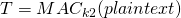

# Encrypt and MAC

Prerequisites:
1. [Message Authentication Code](../../../Message-Authentication-Code/)

  
  
In this article, we will:
1. Discuss Authenticated Encryption techniques using MACs- Encrypt and MAC method. 
2. Implement a simple Authenticated Encryption service using Encrypt-and-MAC technique.
  
  

In this technique of authenticated encryption, encryption as well as authentication tag are calculated separately and on the same string, ie. the plaintext. This implies that the encryption process, in no way, affects the generation of the authentication tag.  
We can write the ciphertext `ct` as:  
, where `E()` is an encryption function, subscript `k1` is the key used for encryption. We can also write the authentication tag `T` as:  
, where `MAC()` is a function that generates a unique identification code, subscript `k2` is the key used by the function.  
  
Also note that to make the authenticated encryption algorithm more secure, we must choose different keys for encryption and for generating MAC. 
  
  
To understand the concept of Encrypt-and-MAC technique clearly, have a look at this illustration from Wikipedia:
  
  
Some authenticated encryption techniques use hashing algorithms to calculate Message Authenticate Code (MAC)- HMAC, while some others use a block cipher mode to calculate it (CBC-MAC).  
  
  

## Communication through Encrypt-and-MAC
Consider Alice as the sender and Bob as the receiver. To send a message, Alice can do the following:
1. Encrypt the message using an Authenticated Encryption algorithm with Encrypt-and-MAC and transmit both the ciphertext and the authentication tag:
   + The string that is to sent should contain IV (if the ciphertext / authentication tag is generated using CBC mode), a ciphertext and an authentication tag.

To know the details, check out this example I have written to help understand Encrypt-and-MAC technique better:  
```python
def encrypt(input_str, iv, key, blocksize):
	input_str = pad(input_str, blocksize)
	obj1 = AES.new(key, AES.MODE_CBC, iv)
	ciphertext = obj1.encrypt(input_str)
	return ciphertext.encode("hex")
	
def cbc_mac_gen(input_str, iv, mac_key, blocksize):
	input_str = pad(input_str, blocksize)
	obj1 = AES.new(mac_key, AES.MODE_CBC, iv)
	auth_tag = obj1.encrypt(input_str)[-blocksize:]
	return auth_tag.encode("hex")

def encrypt_and_mac(input_str, iv, key, mac_key, blocksize):
	return iv.encode("hex") + ":" + encrypt(input_str, iv, key, blocksize) + ":" + cbc_mac_gen(input_str, iv, mac_key, blocksize)	
```

## Authentication through Encrypt-and-MAC
After receiving the ciphertext and the authentication tag Bob does the following:
1. Decrypt the ciphertext to get the plaintext
2. Calculate the authentication tag of the plaintext received and check if it matches with the tag received from Alice.
   + If yes, then the message is valid, otherwise it isn't

I wrote a small example to implement authentication process in Encrypt-and-MAC:  
```python
def decrypt(ciphertext, iv, key, blocksize):
	ciphertext = ciphertext.decode("hex")
	obj1 = AES.new(key, AES.MODE_CBC, iv)
	plaintext = obj1.decrypt(ciphertext)
	return unpad(plaintext)
	
def cbc_mac_auth(input_str, iv, mac_key, blocksize, auth_tag):
	input_str = pad(input_str, blocksize)
	obj1 = AES.new(mac_key, AES.MODE_CBC, iv)
	chk_tag = obj1.encrypt(input_str)[-blocksize:].encode("hex")
	if chk_tag == auth_tag:
		print "Verification Successful"
		return 1
	else:
		print "Verification Failed"
		return 0

def decrypt_and_auth(cookie, key, blocksize, mac_key):
	iv, ciphertext, auth_tag = cookie.split(":")
	iv = iv.decode("hex")
	input_str = decrypt(ciphertext, iv, key, blocksize) 
	if cbc_mac_auth(input_str, iv, mac_key, blocksize, auth_tag):
		return "Plaintext: ", input_str
	else:
		return "Verification failed, so nothing for you!"
```
  
  
You can check out the entire example script [here](enc-and-mac.py)

## Security of Encrypt-and-MAC technique
The whole motive behind using such authenticated encryption systems is to make sure communications take place securely and if it does not provide us satisfiable security levels, what good is the system for us?  
  
Encrypt-and-MAC techniques is one of the weakest techniques among all Authenticated-Encryption-with-MACs. This is due to the fact that usage of not-so-secure MACs can leak some information about the plaintext since MAC is generated from the plaintext directly. The authentication tag has to be random enough to make MAC unforgeable.  
  
Inspite of this Encrypt-and-MAC technique is applied in SSH protocol- the protocol uses strong Hash-based MACs (HMACs) to generate the authentication tags. We will discuss this protocol in detail separately.  
  
  

## References
1. [Authenticated Encryption- Wikipedia](https://en.wikipedia.org/wiki/Authenticated_encryption)
  
  


