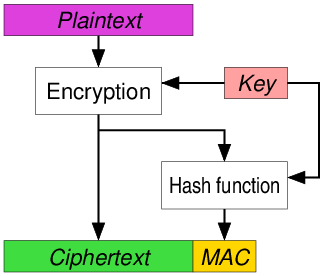

# Encrypt-then-MAC

Prerequisites:
1. [Message Authentication Code](../../../Message-Authentication-Code/)
  
  

In this article we will:
1. Discuss Authenticated Encryption using Encrypt-then-MAC technique
2. Implement a simple Authenticated Encryption service using Encrypt-then-MAC technique
  
  

This method of authenticated encryption is the most secure method among the three techniques, reasons of which is discussed in the last section "Security Analysis of Encrypt-then-MAC". In this technique, ciphertext is generated independent of the MAC, and authentication tag is generated from the ciphertext instead of plaintext. This ensures that authentication tag reveals no information about the plaintext whatsoever.  
  

To understand Encrypt-then-MAC clearly, have a look at this illustration from Wikipedia:
  
  

# Sending messages securely using Encrypt-then-MAC
Consider Alice as the sender and Bob as the receiver. According to Encrypt-then-MAC technique, Alice sends the ciphertext as well as it's corresponding authentication tag to Bob. Bob then authenticates the ciphertext and accepts the message only if the authentication holds true. Let us see how Alice sends the message to Bob:  
1. Let `M` be the message that is to be sent by Alice. Alice first pads the message to make it a multiple of blocksize. He then generates ciphertext corresponding to `M` as:
   + , where k1 is the key used for encryption and `E()` is any reasonably secure block cipher algorithm
2. Next, Alice computes the authentication tag `T` of the ciphertext generated. This is in accordance with Encrypt-then-MAC technique. `T` is generated as:
   + , where k2 is the key used for generating the authentication tag
   + Note that the algorithm used to generate authentication tag can either be a Hash based MAC (HMAC) or a block-cipher-mode based MAC (CBC-MAC)
3. Alice now concatenates ciphertext `C` and it's corresponding authentication tag `T` using a separator. Sends the resultant string to Bob.
  
  

Let us implement the above process in python-2.7:
```python
def encrypt(input_str, iv, key, blocksize):
	input_str = pad(input_str, blocksize)
	obj1 = AES.new(key, AES.MODE_CBC, iv)
	ciphertext = obj1.encrypt(input_str)
	return ciphertext

def cbc_mac_gen(input_str, iv, mac_key, blocksize):
	input_str = pad(input_str, blocksize)
	obj1 = AES.new(mac_key, AES.MODE_CBC, iv)
	auth_tag = obj1.encrypt(input_str)[-blocksize:]
	return auth_tag

def encrypt_then_mac(input_str, iv, key, mac_key, blocksize):
	ciphertext = encrypt(input_str, iv, key, blocksize)
	tag = cbc_mac_gen(ciphertext, iv, mac_key, blocksize)
	return ciphertext.encode("hex") + ":" + tag.encode("hex")
```
  
  

## Authentication using Encrypt-then-MAC
After receiving Alice's message:  
1. Bob splits the string received into two, first part is the ciphertext `C` and second part is the authentication tag `T`.
2. Authentication Step:
   + Bob checks if MAC of the ciphertext received is equal to the authentication tag received: 
     + If they match, then the process moves onto the next step, otherwise Bob would send a VerificationError to Bob and will not move further.
3. After the ciphertext is authenticated, Bob decrypts the message `M` as:
   + , where D() is the decryption function
4. Bob sends an acknowledgement to Alice that the message has been received and read
  
  

Let us implement the above authentication process in python-2.7:
```python
def decrypt(ciphertext, iv, key, blocksize):
	obj1 = AES.new(key, AES.MODE_CBC, iv)
	plaintext = obj1.decrypt(ciphertext)
	return unpad(plaintext)

def auth_check(session_cookie, iv, key, mac_key, blocksize):
	ciphertext, tag = session_cookie.split(":")
	ciphertext = ciphertext.decode("hex")
	tag = tag.decode("hex")
	if cbc_mac_gen(ciphertext, iv, mac_key, blocksize) == tag:
		print "Authentication Successful"
		return decrypt(ciphertext, iv, key, blocksize)
	else:
		print "Authentication Failed"
		return 0
```
  
  
You can check out the entire example script [here](encrypt-then-mac.py)

## Security Analysis of MAC-then-Encrypt
MAC-then-Encrypt technique is the most secure technique for Authenticated Encryption with MACs among all the three techniques. This is because in other two techniques, the receiver will have to decrypt the message and authenticate only after decryption. This can be dangerous as it leaks corrupted plaintext to the receiver.  
  
Also, the technique we have discussed is more efficient as the receiver does not have to worry about time taken to decrypt the ciphertext. This reduces time and computational power. The receiver will only decrypt ciphertext upon authentication, otherwise it simply will return a VerificationError.
  
  

## References
1. [Authenticated Encryption -Wikipedia](https://en.wikipedia.org/wiki/Authenticated_encryption)
  

