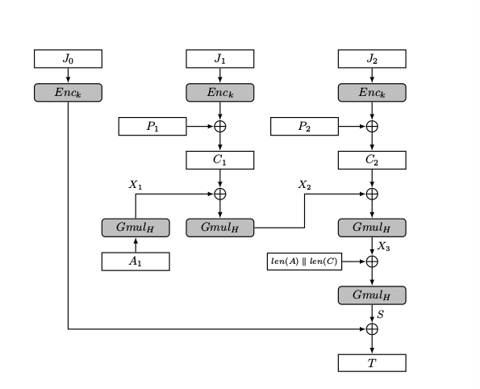

# AES-GCM

Prerequisites:
1. [CTR mode of Encryption](https://github.com/ashutosh1206/Crypton/tree/master/Block-Cipher/Mode-of-Encryption#ctr-mode-counter-mode)
2. [Authenticated Encryption](../README.md)
3. [Authenticated Encryption with Associated Data](https://github.com/ashutosh1206/Crypton/tree/master/Authenticated-Encryption/#authenticated-encryption-with-associated-data-aead)
4. [Number Theory- Finite Fields]()

AES-GCM is an example of Authenticated Encryption with Associated Data (AEAD) based system. As the name suggests, the algorithm used for encryption is AES along with Galois Counter Mode (GCM) for authentication. GCM is similar to CTR mode of block cipher mode of encryption- GCM has an added component for computing the authentication tag.  
  
In this section, we will discuss the following internals of AES-GCM: 
1. How encryption takes place
2. Authentication internals in AES-GCM- Wegman Carter MAC
  

AES-GCM also has the concept of adding nonces during encryption; nonces are basically strings that are used only once during encryption. This is to ensure that the cipher is in no way predictable. In the next section, we will see in detail, how nonces are included during encryption.
  
We will also see how security of AES-GCM gets affected when nonces are repeated (Forbidden Attack)
  
  
This is how AES-GCM looks like:  
  
  
There are some notations in the picture plus we will also be using some notations frequently in this article, so let us define them now for our convenience:  
> 1. <strong>J<sub>i</sub></strong>: `i`-th block constructed from concatenation of a 96 bit nonce and a 32 bit counter. This block is then encrypted using AES.  
> 2. <strong>P<sub>i</sub></strong>: `i`-th block of plaintext  
> 3. <strong>C<sub>i</sub></strong>: `i`-th block of ciphertext  
> 4. <strong>E<sub>k</sub>()</strong>: Encryption function with key `k`  
> 5. <strong>D<sub>k</sub>()</strong>: Decryption function with key `k`  
> 6. <strong>T</strong>: Authentication Tag  
> 7. <strong>Gmul<sub>H</sub>(X)</strong>: Modular Multiplication H.X in Galois Field GF(2**128), with irreducible polynomial f = 1 + x + x<sup>2</sup> + x<sup>7</sup> + x<sup>128</sup>  
> 8. <strong>len(X)</strong>: 64 bit representation of length of string X  
> 9. <strong>A</strong>: Associated Data that is to be authenticated but not encrypted  
  

## Encryption in AES-GCM
Encryption in AES-GCM is almost the same as AES-CTR mode of encryption. Let us look at how plaintext is encrypted using AES-CTR:  
  
  
Let us see how encryption in AES-GCM mode takes place:  
1. A random nonce/IV of size 96 bits (or 12 bytes) is generated using a secure pseudo random number generator. IV must be known only to the sender and the receiver.
2. IV is then concatenated with a 32 bit counter `ctr`, starting from 1 (The counter starts from 0 in the case of CTR mode for encrypting the plaintexxt). The concatenated string block is of size 128 bits and can now be encrypted.
3. The block is encrypted with AES using key. This results into a string `s` of size 16 bytes or 128 bits.
4. The resultant string `s` is XORed with the first block of plaintext to get the first block of ciphertext. Value of counter is then increased by 1.
5. Steps 1 to 5 are repeated for each value of counter and different plaintext blocks. 
6. Note that for the last block of plaintext, if the plaintext block is not a multiple of 16 (ie. the blocksize), `s` will be sliced to a length equal to the length of last block of plaintext and then XORed with the last block of plaintext. 
  

Note that there is more to AES-GCM than just encryption and that is the process of generating Authentication Tag, which we will see in the next section.
  
  
The code below is a basic implementation of encryption part in AES-GCM:
```python
class AES_GCM:
	"""
	Implementation of encryption/decryption in AES_GCM using AES_ECB of pycrypto
	"""
	def __init__(self, key, nonce):
		"""
		Initialising key for cipher object
		"""
		try:
			assert len(key) == 16 or len(key) == 24 or len(key) == 32
			assert len(nonce) == 12
			self.key = key
			self.nonce = nonce
		except:
			raise ValueError("[+] Key length must be of length 16, 24 or 32 bytes and nonce must be of size 12 bytes")
	
	def _encrypt(self, plaintext):
		"""
		Encryption of plaintext using key and nonce in CTR mode
		96 bit nonce and 32 bit counter starting from 1
		"""
		plaintext = [plaintext[i:i+16] for i in range(0, len(plaintext), 16)]
		ciphertext = ""
		for i in range(len(plaintext)):
			construct_nctr = bin2str(str2bin(self.nonce) + bin(pow(i+1, 1, 2**32))[2:].zfill(32))
			assert len(construct_nctr) == 16
			obj1 = AES.new(self.key, AES.MODE_ECB)
			ct = obj1.encrypt(construct_nctr)
			ciphertext += xor(plaintext[i], ct)
		return ciphertext

	def _decrypt(self, ciphertext):
		"""
		Decryption of ciphertext using key and nonce in CTR mode
		96 bit nonce and 32 bit counter starting from 1
		"""
		ciphertext = [ciphertext[i:i+16] for i in range(0, len(ciphertext), 16)]
		plaintext = ""
		for i in range(len(ciphertext)):
			construct_nctr = bin2str(str2bin(self.nonce) + bin(pow(i+1, 1, 2**32))[2:].zfill(32))
			assert len(construct_nctr) == 16
			obj1 = AES.new(self.key, AES.MODE_ECB)
			pt = obj1.encrypt(construct_nctr)
			plaintext += xor(ciphertext[i], pt)
		return plaintext
```
  
  

## Authentication Tag generation in AES-GCM
The process of generating Authentication Tag in AES-GCM is an [Encrypt-then-MAC](../AE-with-MACs/Encrypt-then-MAC/) construction, and Wegman-Carter MAC with a few tweaks is used for generating Authentication Tag.  
  
The function used for generating Authentication Tag is also known as GHASH()  
  
Authentication Tag in AES-GCM is generated using the following steps:  
1. The secret string `H` is generated as H = E<sub>k</sub>("\x00"*16) ("\x00"*16 is a null string of size 16 bytes)
2. Authentication Tag is generated in a series of steps, block wise. Hence, for each block of associated data A<sub>i</sub>, a string X<sub>i</sub> is generated using the following computation, and this contributes to the final authentication tag: 
   + X<sub>i</sub> = Gmul<sub>H</sub>(X<sub>i-1</sub> xor A<sub>i</sub>), for i = 1,..., m, X<sub>0</sub> = 0. Here `m` is the number of blocks to be authenticated only (Associated Data blocks).
3. Now that associated data blocks A<sub>i</sub> have been included in the authentication tag, the current authentication tag will be processed and `n` ciphertext blocks will also be included in the authentication tag:
   + X<sub>i+m</sub> = Gmul<sub>H</sub>(X<sub>i+m-1</sub> xor C<sub>i</sub>), for i = 1,..., n. Here `n` is the number of blocks of ciphertext.
4. After the above step, 64 bit representation of length of Associated Data `A` is concatenated with 64 bit representation of length of ciphertext `C`. The resultant string is supplied as a parameter to Gmul<sub>H</sub>() as follows:
   + S = Gmul<sub>H</sub> = (X<sub>m+n</sub> xor (len(A) || len(C)))
5. Authentication Tag `T` is generated as:
   + T = S xor E<sub>k</sub>(J<sub>0</sub>)

**Note**: Authentication tag in AES-GCM can be generated parallely after generation of each block of ciphertext from the encryption function.   
  

The service returns concatenation of ciphertext `C` and corresponding authentication tag `T` as the final output!  
  

Here is a trivial implementation of Authentication part of AES-GCM:
```python
def mod_polynomial_mult(self, a, b, p):
        """
        Multiplication of polynomials a.b modulo an irreducible polynomial p over GF(2**128)
        Assertion: a, b must already belong to the Galois Field GF(2**128)
        """
        assert len(bin(a)[2:]) <= 128
        assert len(bin(b)[2:]) <= 128
        result = 0
        for i in bin(b)[2:]:
                result = result << 1
                if int(i):
                        result = result ^ a
                if result >> 128:
                        result = result ^ p
        return result

def authtag_gen(self, ciphertext1):
        """
        Generating auth-tag using ciphertext and associated data 
        """
        ciphertext = [str2int(ciphertext1[i:i+16]) for i in range(0, len(ciphertext1), 16)]
        associated_data = [str2int(self.associated_data[i:i+16]) for i in range(0, len(self.associated_data), 16)]

        obj1 = AES.new(self.key, AES.MODE_ECB)

        # Step-1: Secret String Generation
        H = str2int(obj1.encrypt("\x00"*16))
        X = 0
        p = (1<<128) + (1<<7) + (1<<2) + (1<<1) + 1
        
        # Step-2: Modular Polynomial Multiplication of Associated Data blocks with H
        for i in range(len(associated_data)):
                X = self.mod_polynomial_mult(X, associated_data[i], p)

        # Step-3: Modular Polynomial Multiplication of Ciphertext blocks with H
        for i in range(len(ciphertext)):
                X = self.mod_polynomial_mult(X, ciphertext[i], p)

        # Step-4: Modular Polynomial Multiplication of H with (bit length of A concatenated with bit length of C)
        la = bin(len(self.associated_data))[2:].zfill(64)
        lc = bin(len(ciphertext1))[2:].zfill(64)
        res = int(la + lc, 2)
        S = self.mod_polynomial_mult(X, res, p)

        # Step-5: XORing S with E(J0) ie. XORing S obtained above with ciphertext of (iv || ctr)
        obj1 = AES.new(self.key, AES.MODE_ECB)
        construct_nctr = bin2str(str2bin(self.nonce) + "0"*32)
        T = S ^ str2int(obj1.encrypt(construct_nctr))

        return int2str(T)

```

You can check out the entire implementation of AES-GCM [here](AES-GCM-implementation.py).

## References
1. [Recommendation for Block Cipher modes of Operation: Galois Counter Mode (GCM)- National Institute of Standards and Technology (NIST)](https://nvlpubs.nist.gov/nistpubs/Legacy/SP/nistspecialpublication800-38d.pdf)
2. [Nonce-Disrespecting Adversaries: Practical Forgery Attacks on GCM in TLS](https://eprint.iacr.org/2016/475.pdf)