# Invalid Curve Point Attack

**Prerequisites**:
1. [Discrete Logarithm Problem](../../Discrete-Logarithm-Problem/README.md)
2. [Diffie Hellman Key Exchange](../README.md)
3. [Small Subgroup Confinement Attack](../Attack-Small-Subgroup-Confinement/README.md)
4. [Elliptic Curves](../../Elliptic-Curves/)
5. [Elliptic Curve Diffie Hellman]()

In this article, we will discuss an online attack on ECDH that arises due to incorrect check mechanism for points on an Elliptic Curve, eventually leading to leakage of secret key of the target involved, under specific circumstances.

The write-up is divided into three sections:
1. Attack Case Scenario
2. Invalid Curve Point Attack
3. Protections against the Attack

**Note**: The attack can be considered a variant of Small Subgroup Confinement Attack, but the circumstances under which a typical Small Subgroup Confinement works in ECDH and those under which Invalid Curve Point attack works are completely different.

>**Variable Notation**:
1. **E**: Elliptic Curve defined as 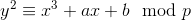
2. **a**: Parameter of the Elliptic Curve 
3. **b**: Parameter of the Elliptic Curve 
4. **e**: Cardinality of the curve E
5. **P**: Base point on the Elliptic Curve `E`. 
6. **c**: Order of the subgroup generated by `P`
7. **Q**: Alice's public key
8. **x**: Alice's secret key
9. **u**: Upper limit in the range of `x` and is equal to `c`
10. **n<sub>i</sub>**: Cardinality of curve E<sub>i</sub>, where (0 <= i <= 1)


## Attack Case Scenario and Background
Alice and Bob decide to exchange public keys using ECDH and derive the shared secret `S`. The x-coordinate of the shared secret is then used as a key for MAC.

As an attacker, our motive is to get Alice's secret key.

To send keys via ECDH, they need to choose a finite field over which all the necessary computations can happen. Assume it to be **GF(p)**. In most cases, `p` will chosen as be a prime number for convenience.

Suppose Alice and Bob choose `P` as the base point for ECDH computation.  

We know that Small Subgroup Confinement attack will work in cases when order `c` of the subgroup generated by base point `P` on the curve has many smaller factors.

What if `c` doesn't have small factors? Can we do something in such a situation?

Suppose initialisation of any point on the curve looks like this:
```python
class Point( object ):
    def __init__( self, curve, x, y, order = None ):
        self.__curve = curve
        self.__x = x
        self.__y = y
        self.__order = order
        if order:
            assert self * order == INFINITY
```

Do you see anything missing in the above code snippet?  
**A point** that is **not on** the **curve** will be **initialised** without any error, since there is no mechanism to check that!

The question is, can we do something with it?

Let us dig into Elliptic Curves to find an answer to the above question
Have a look at the formula for point doubling in an Elliptic Curve  
  
*[Point Doubling in Elliptic Curves](https://github.com/ashutosh1206/Crypton/tree/master/Elliptic-Curves#point-doubling)*

Notice that point doubling and point addition do not depend on `b` parameter of an Elliptic Curve, hence changing the value of `b` will not change the results of Elliptic Curve Arithmetic (Scalar Multiplication, Point Addition, Point Doubling) on any pair of points.

Using the above property, we can say that different points can be chosen from different curves having the same `a` but different values of `b`:  
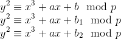  

Now we have multiple curves from which we can choose our points and share as public keys, and this will not affect the results of Elliptic Curve Arithmetic due to reasons we discussed above. We can selectively choose points having small order of the subgroup, generated by scalar multiplication.

The remaining steps are the same as Small Subgroup Attacks on ECDH- find value of `x` mod different moduli and as soon as the moduli product exceeds the upper limit of `x`, calculate the CRT to get the value of `x`

But, it's not so easy as it sounds. There are some complications in the attack, as we will see in the next section.

## Invalid Curve Point Attack
The attack requires the attacker to be able to intercept the channel (Man-In-The-Middle)

1. At first, Alice calculates her public key as 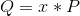, where `P` is the base point on an Elliptic Curve `E`, and shares it over the channel

2. Find the upper limit of `x` and assign it as `u`. The upper limit is equal to the order of the subgroup generated by point `P`.  How do we calculate the order of the subgroup generated by point `P`?
   + We know from Lagrange's Theorem that order of the subgroup generated by any point on a curve is a divisor of the cardinality of that curve.

   + Calculating order of a point `P` on a curve `E`: Find smallest divisor `i` of cardinality of the curve `E` such that 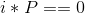  

3. Find suitable curves with cardinality having many small factors
   + 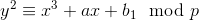 --> E<sub>1</sub>
   + 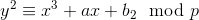 --> E<sub>2</sub>

   + To choose appropriate values of b<sub>1</sub> & b<sub>2</sub>, iterate over possible values of b<sub>i</sub>, calculate the cardinality of the curve and check if it has multiple small factors.

4. Select a point P<sub>i</sub> from a curve E<sub>i</sub> (0 <= i <= 1), having a small order 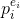, where p<sub>i</sub> is a prime number and is a factor of the cardinality n<sub>i</sub> of the curve E<sub>i</sub>. Now, the question is: how do we select such a point?

   + Find a generator point `X` on the curve E<sub>i</sub>. A generator point here means that `X` can be used to generate all points on the Elliptic Curve upon scalar multiplication. 

   + Calculate 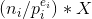 and check if it is equal to arbitrary point at INFINITY(0, 0)
     + If True, then select another generator point `X` on the curve and repeat this process.

     + If False, then the resultant point P<sub>i</sub> =  has order . Move to step-5.

5. Send this point P<sub>i</sub> to Alice as your public key.

6. Alice calculates the shared secret `S` as 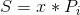

7. Alice computes **MAC(S[0], "testmessage")** and shares it over the channel. Let the value of MAC be `M`.

   +  Notice that only the `x`-coordinate of the shared secret `S` is used for calculating the Message Authentication Code, hence the notation S[0]

8. We intercept the channel again and get the value of MAC `M`. Since order of P<sub>i</sub> is , we have effectively reduced the possible values of S[0]. All we need to do now is to find 1 < k <  such that MAC((k\*P<sub>i</sub>)[0], "testmessage") == `M`. Here is where a problem arises:

   +  We can find two such values of `k` having the same (k\*P<sub>i</sub>)[0]. **Why** does this **happen**? We know that P and (-P) have the same value of `x` coordinate. Hence, the x-coordinate of 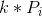 and that  will be the same. Therefore, we have `k` and `-k mod p`, which when multiplied with P<sub>i</sub> give the same value of x-coordinate.

   + **How** do we **solve this problem**? We know that 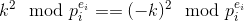. So, what we can do is find 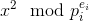 instead of finding 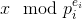, by finding any `k` in the range 1 < k <  such that MAC((k\*P<sub>i</sub>)[0], "testmessage") == `M`.

     + Finding `k` is very easy as we have reduced the range of possible values of `k` to less than or equal to .

   + 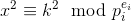

Repeat steps 4-8 for different points P<sub>i</sub> having different orders 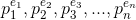 (where p<sub>1</sub>, p<sub>2</sub>, p<sub>3</sub>,..., p<sub>n</sub> are primes) on curves E<sub>1</sub> and E<sub>2</sub> to obtain:  
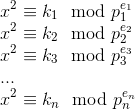  
^^ label the above system of equations as (1)

Since, p<sub>1</sub>, p<sub>2</sub>, p<sub>3</sub>,..., p<sub>n</sub> are primes,  are pairwise coprime.

One thing to remember is that we can solve (1) only if 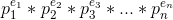 >= u, where `u` is the upper limit of range of possible values of secret key `x`. Otherwise, find values of  for more values of  until the product  >= u.

We can perform Chinese Remainder Theorem and get the value of 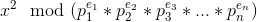. Since, `x` < . We can uniquely determine value of `x` from  by using [Tonelli Shanks Algorithm](https://en.wikipedia.org/wiki/Tonelli%E2%80%93Shanks_algorithm) to get value of 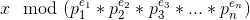!


# References
1. [Pratical Invalid Curve Point Attacks on TLS-ECDH](https://www.nds.ruhr-uni-bochum.de/media/nds/veroeffentlichungen/2015/09/14/main-full.pdf)
2. [Validation of Elliptic Curve Public Keys](https://www.iacr.org/archive/pkc2003/25670211/25670211.pdf)
