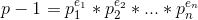
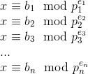
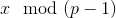
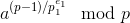
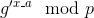
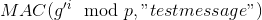
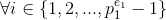
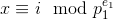

# Small Subgroup Confinement Attack

**Prerequisites**:
1. [Discrete Logarithm Problem](../../Discrete-Logarithm-Problem/README.md)
2. [Diffie Hellman Key Exchange](../README.md)

In this article we will discuss an attack on DHKX that arises due to incorrect choice of groups for the key exchange, leading to leakage of secret key of the target involved, under specific circumstances.

The write-up is divided in the following sections:
1. Attack Case Scenario
2. Small Subgroup Confinement Attack (SSCA)
3. Protections against the Attack

**Note**: The attack is applicable over both Algebraic DHKX and Elliptic Curve based DHKX, under circumstances that we will discuss in the next section. However, in this article, we will explain the attack using Algebraic DHKX only.

>**Variable Notation**:
1. `G`: Algebraic group over which DH is defined
2. `g`: Base point generator of the algebraic group `G`
3. `p`: Modulus of the group `G`
4. `q`: Order of subgroup generated by `g`
5. `x_a`: Alice's secret key
6. `x_b`: Bob's secret key
7. `A`: Alice's public key
8. `B`: Bob's public key
9. `k`: Shared key

## Attack Case Scenario and Background
Alice and Bob decide to exchange public keys using DHKX and derive the shared secret. The shared secret is then used as a key for MAC.

As an attacker, our motive is to get Alice's secret key.

To send keys via DHKX, they need to choose a group over which all the necessary computations can happen. Assume the group to be . In most cases, `p` will chosen as be a prime  number for convenience.

Since, `p` is be prime, `p-1` will surely be an even number. Suppose Alice chooses a base element `g` that generates a subgroup of order `q`.

We know by [Lagrange's Theorem](https://en.wikipedia.org/wiki/Lagrange%27s_theorem_(group_theory)) that order of the subgroup generated by `g` is a factor of the cardinality of the group . We also know that larger the size of the subgroup generated by the base element `g`, the more difficult it is to solve DLP.

Our goal as an attacker is to somehow minimize the time required to solve the DLP.

Suppose cardinality of the group  = , where p1, p2, ..., pn are primes and p1, p2, ..., pn < p-1

What if we, as an attacker, get the values of  
  
(where `x` is the secret key of either Alice or Bob)  
then we can reduce the time required to solve DLP, now we can solve for `x` in every group piei and then compute CRT to get the value of  =  = x

If piei is large enough that we could not compute `x` over the modulus (piei), then the problem becomes difficult to solve!

We will now discuss online MITM attack on Diffie Hellman Key Exchange that is based on the concept discussed above- effectively reducing the group to a smaller size and then compute CRT to get the original value of secret key.

For illustrative purposes, consider we want to get the value of Alice's secret key - xa

## Attack in practice
This requires the attacker to be able to intercept the channel (Man-In-The-Middle).

1. At first, Alice calculates her public key as  and shares it over the channel.

2. We intercept the channel and get Alice's public key `A`. We now need to send an element `g'` to Alice, which when exponentiated, can produce a subgroup of order p1e1

3. To get `g'`, we take a generator `g` of the group  and check if  != 1

   + If True, then the resultant value is the element `g'` in the group having order p1e1

   + If False, then choose another generator `g` in the group and go back to Step-3.
4. Now that we have an element `g'` of order p1e1, send `g'` to Alice. Alice will think that this is a public key.

5. Alice calculates secret key as: k = 
6. Alice computes **MAC(k, "testmessage")** and send the MAC over the channel. Let the value of the MAC be `M`

7. We intercept the channel again. Since order of `g'` is p1e1, we have effectively reduced the possible values of `k`. All we need to do now is to brute force every value of `x_a` over (mod p1e1) by checking if  == `M`, :
   + If True, then we can say that 
     + b1 = i
   + If False, check for the next value of `i`

Repeat the above steps for p1e1, p2e2, ..., pnen and get the values of b1, b2, ..., bn

Now, we have the values of  

We can calculate `x` easily using CRT now :)

Note that it is not necessary that one has to calculate `x` over all the factors of cardinality of the group ie. `p-1`, it all depends on the range of values of `x`, which in turn depends on the base element `g`. So if `g` has a very small order, then we only need to calculate `x` only over those factors that would be enough to recover `x` fully!

# References
1. [FlorianJW- On Generators in Diffie Hellman Groups](https://florianjw.de/en/insecure_generators.html)
2. [Cryptopals-Subgroup Confinement Attack (Challenge 57)](https://toadstyle.org/cryptopals/57.txt)
