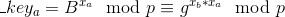
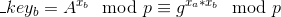
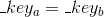

# Diffie Hellman Key Exchange

**Prerequisites**:
1. [Discrete Logarithm Problem](../Discrete-Logarithm-Problem)


## Introduction
Suppose Alice and Bob want to talk to each other secretly, so they decide that they will encrypt messages and send it over the insecure channel for communication. They will have to decide upon a key to encrypt the messages, and this key cannot pass through the same insecure channel because if an attacker knows the key, plaintext can be easily be recovered from the ciphertext.

To overcome this problem, there is an algorithm- Diffie Hellman Key Exchange created by Diffie and Hellman for secure exchange of keys over the insecure channel. The algorithm is based on various Number Theoretic concepts, as we will see in the next few sections.

This write-up is primarily for Algebraic Diffie Hellman Key Exchange, there is another section in the same directory for Elliptic Curve based Diffie Hellman Key Exchange (ECDH and ECDHE).

Please note that the security of Diffie-Hellman is primarily based on the security of Discrete Logarithm Problem(DLP), so it is strongly recommended that you read and get familiar with [DLP](../Discrete-Logarithm-Problem) before moving on further.

This directory also contains various complications involved while implementing Diffie Hellman Key Exchange:
1. DH groups with smooth order
2. Small subgroup attacks on DH
3. Ensuring Forward Secrecy: Ephemeral Diffie-Hellman - TBA


## Diffie Hellman Key Exchange

**Case Scenario**: Suppose Alice wants to send a message to Bob. Consider Alice as the first person who will generate public key and share it with Bob publicly.

There are a number of steps involved in Diffie Hellman Key Exchange. This is just to give you an idea of how the protocol works, we will discuss public key generation and shared key calculation in detail in the upcoming sections:
1. **Group Selection Agreement**
2. **Public Key Generation- Alice's Side**
3. **Public Key Generation- Bob's Side**
4. **Shared Key Calculation- Bob's Side**
5. **Shared Key Calculation- Alice's Side**


>**Variable Notation**:
1. `G`: Algebraic group over which DH is defined
2. `g`: Base point generator of the algebraic group `G`
3. `p`: Modulus of the group `G`
4. `q`: Number of elements in the group `G`
5. `x_a`: Alice's secret key
6. `x_b`: Bob's secret key
7. `A`: Alice's public key
8. `B`: Bob's public key
9. `k`: Shared key

### [0] Group Selection Agreement
In this step, Both Alice (Sender) and Bob (Receiver) agree on an algebraic group `G` =  and compute it's generator `g` that they will use for calculating respective private and public keys.

For security purposes, the cardinality of the group should be large, otherwise the DLP can be solved in polynomial time. Also, it is essential to keep modulus `p` of the form `2*r + 1`, where `r` another prime number.

To find out the multiplicative generator of an algebraic Cyclic Group, you can use sagemath:
```python
p = (1 << 1024) - 1093337
G = IntegerModRing(p)
G.multiplicative_generator()

> 7 # Generator for the Cyclic Group Z_p*
```

### [1] Public Key Generation (PKG)
In this step, Alice and Bob calculate their respective private-public keys

### [2] PKG - Alice's Side
To generate the public key, Alice does the following computation:
1. Generates `x_a` using a cryptographically secure pseudo random number generator
2. She computes 
3. Lastly, she sends `A` to Bob over the insecure channel

### [3] PKG - Bob's Side
To generate the public key, Bob does the following computation:
1. Generates `x_b` using a cryptographically secure pseudo random number generator
2. He computes 
3. Lastly, he sends `B` to Alice over the insecure channel

### [4] Shared Key Calculation - Bob's Side
After Alice receives Bob's public key `B`, she calculates the following:
1. 

### [5] Shared Key Calculation - Alice's Side
After Bob receives Alice's public key `A`, he calculates the following:
1. 


Notice that `_key_a` and `_key_b` have the same values:  

Hence both of them have calculated the same value, securely. Question- How "securely"? Let us see how.

Consider an attacker who was somehow able to intercept the communication established between Alice and Bob. In such cases, the attacker will only have information of `A`, `B`, `g` and `G`, since only this information is sent via the insecure channel. Remember that secret keys are not exchanged, only Alice knows her secret key `x` and only Bob knows his secret key `y`.

Hence, having information of `A`, `B`, `g` and `G` is not sufficient to calculate the shared secret!

**Another Question**: What if the attacker is able to solve any of the Discrete Logarithm Problems:   or  ?  
Clearly, he/she will then be able to calculate the shared secret, breaking the security of Diffie Hellman Key Exchange.

I have written a simple implementation of Diffie Hellman Key Exchange here: [example.py](example.py)

If you want to read more details about DHK, I strongly recommend you to read Page 401-406 of the textbook: ["A graduate course on Applied Cryptography": version-0.4](https://crypto.stanford.edu/~dabo/cryptobook/)

## References and Resources
1. [A graduate course on Applied Cryptography version 0.4: Page 401-406](https://crypto.stanford.edu/~dabo/cryptobook/)
2. [Introduction to Cryptography by Christof Paar- DHK and DLP](https://www.youtube.com/watch?v=aeOzBCbwxUo)
3. [David Wong- How to backdoor Diffie-Hellman](https://eprint.iacr.org/2016/644)
