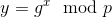
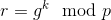
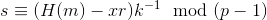
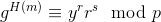
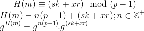
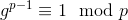
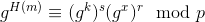
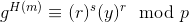

# ElGamal Signature Scheme

Prerequisites:
1. Cyclic Groups
2. [Discrete Logarithm Problem](../../Discrete-Logarithm-Problem/)
3. [ElGamal Encryption System](../../Elgamal-Encryption/)
  
  

ElGamal Signature Scheme is a Signature Authentication Algorithm, with the security level as same as that of Discrete Logarithm (DLP), we will see this as we move forward.  
For illustrative purposes, we will consider `Alice` as the signer and `Bob` as the verifier.  
  
There are different steps involved while signing or verifying data/signatures respectively with ElGamal, let's list them first and then study each of them in detail:  
1. **Key Generation**: Alice generates a pair of public and private keys. Shares the public key `(g, y, p)`.
2. **Signature Generation**: Alice uses her private key to generate the signature of the Hash of a message `m` with the help of another variable `r` (`r` is public). Shares signature `s`, `r`, and `m`.
3. **Signature Verification**: Bob then uses Alice's public key to do computation on `s` and checks if it matches with `Hash(m)`, if yes then the signature is valid, otherwise it isn't.
  
  

## Key Generation
This step is done by the signer- Alice. Alice's Public and Private keys are generated using the following steps:  
1. Selects a Cyclic Group `G` of order `p` and generator `g`
2. Chooses a random integer `x` such that `1 < x < p-2`
3. Calculates 
4. Shares `y`, `p`, `g`
  

Here is a python-2.7 implementation of the above step:  
```python 
def key_gen(bit_size):
	p = getPrime(bit_size)
	g = 2
	x = random.randint(2, p-3)
	y = pow(g, x, p)
	return (y, p, g)
```
  
  

## Signature Generation
In this step, Alice does the following:  
1. Selects a random integer `k` such that `1 < k < p-2` and `GCD(k, p-1) = 1`
2. Calculates `r` as: 
3. Calculates hash of the message `m` to be signed as `H(m)`, where `H()` is the hashing algorithm agreed upon by both signer and verifier.
4. Calculates signature `s` as 
4. Shares `r`, `s`, `m`
  

Here is a python-2.7 implementation of the above step:  
```python
def sign(message, y, p, g):
	h = hashlib.md5(message).hexdigest()
	while True:
		k = random.randint(2, p-2)
		if GCD(k, p-1) == 1:
			break
	r = pow(g, k, p)
	s = ((h-(x*r))*inverse(k, p-1)) % (p-1)
	return (r, s, message)
```
  
  

## Signature Verification
Bob, after receiving public key and signature values, computes the following for verification:  
1. Computes H(m)
2. Checks if  
    , if it is **True**, then the signature is successfully verified, if not, then the oracle throws an Exception
3. Proof
   + Step-2 is true for valid signatures because 
     + 
   + We have from Fermat's Little Theorem that when `GCD(g, p) == 1`: 
   + Therefore we can write: 
   + And hence 
  

Here is a python-2.7 implementation of the above step:  
```python
def verify(message, s, r, y, p, g):
	try:
		assert r > 0 and r < p
		assert s > 0 and s < p-1
		h = hashlib.md5(message).hexdigest()
		assert pow(g, h, p) == (pow(r, s, p)*pow(y, r, p)) % p
		print "Signature successfully verified!"
	except:
		raise VerificationError("Invalid Signature!")
```
Check out the complete trivial implementation/example of Signature Signing and Verification [here](example.py)
  
  

## References
1. [Wikipedia- ElGamal Signature Scheme](https://en.wikipedia.org/wiki/ElGamal_signature_scheme)
