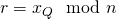
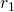
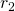
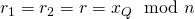
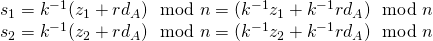
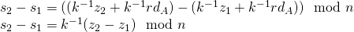
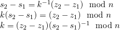
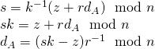

# Attack k-reuse

Prerequisites:
1. [Elliptic Curves](../../../Elliptic-Curves/)
2. [Elliptic Curves Digital Signature Authentication](../)
  
  

In this section, we will discuss an attack on Elliptic Curve Digital Signature and Authentication- attack due to improper implementation of ECDSA, leading to knowledge of the private key of the signer and forging of signatures.  
  
  
Before we move onto the attack, it is important for the reader to know how signatures are generated using Elliptic Curves: [Signature Generation using Elliptic Curves](https://github.com/ashutosh1206/Crypton/tree/master/Digital-Signatures/Elliptic-Curve-DSA#signature-generation)
  
  
Consider a scenario where the signer (Alice) generates two signatures corresponding to two different messages, using the same value of `k`. As we already know `k` is any integer between 1 and `n-1`, where `n` is the order of the subgroup generated. Let the signature pairs, that have been generated using the same `k` be <strong>(r1,s1)</strong> and <strong>(r2, s2)</strong>.  
  
We will first see that the values of `r` generated for signing the two messages using the same value `k` will also be the same ie. r1 = r2:  
1. We know that ,  and `k` is common for two signatures generated.
   + Hence for  and  we can write: .
  
  

We have signature pairs for two messages `M1` and `M2` equal to <strong>(r, s1)</strong> and <strong>(r, s2)</strong> respectively, generated using the same `k`. The next step is to retrieve the value of `k` and then use it to get the value of Alice's private key (Signer's private key). To retrieve the value of `k`, we can write:  
1. , where z1 and z2 are Ln left-most bits of HASH(M1) and HASH(M2) respectively.
2. Subtracting s1 from s2 we get:
   + 
3. Thus,
   + 
  
  

Now that we have the value of `k`, we can calculate Alice's private key. We can use any of the two signatures (the ones that are generated using the same `k`) to retrieve the value of dA (Alice's private key):  
  
  
  
The attacker can use the private key dA to generate a valid signature of any message `M`.
  
  
# References
1. [Wikipedia- ECDSA](https://en.wikipedia.org/wiki/Elliptic_Curve_Digital_Signature_Algorithm)
2. [Andrea Corbellini's blog](http://andrea.corbellini.name/2015/05/30/elliptic-curve-cryptography-ecdh-and-ecdsa/)

