# Elliptic Curve Digital Signature Authentication

Prerequisites:
1. [Elliptic Curves](../../Elliptic-Curves/)
   + Point Addition, Scalar Multiplication
2. [Cyclic Groups on Elliptic Curves](https://github.com/ashutosh1206/Crypton/tree/master/Discrete-Logarithm-Problem/Elliptic-Curve-DLP#defining-cyclic-group-over-elliptic-curves)
  
  

In this section, we will discuss the following topics:  
1. Signature Generation using Elliptic Curves
2. Signature Verification using Elliptic Curves
3. Correctness of the signature algorithm
  
  

Consider `Alice` as the person who is generating a signature of a message `M` and `Bob` as a signature verifier.  
  
  
Let us define the notations that will be used throughout this writeup:  
> 1. <strong>G</strong> - a point on the Elliptic Curve, chosen as the base point
> 2. <strong>xQ, yQ</strong> - x, y coordinates of a point Q on the Elliptic Curve
> 3. **n** - order of the subgroup generated by P
> 4. **N** - order of the Elliptic Curve
> 5. **p** - size of the finite field over which the Elliptic Curve is defined
> 6. **e** - HASH(m), where HASH() is a [cryptographically secure hash function](https://en.wikipedia.org/wiki/Security_of_cryptographic_hash_functions#Provably_secure_hash_functions). A hashing algorithm is selected by signature generator and verifier when the communication between the two is just established.
> 7. **z** - Ln left most bits of `e`, where Ln is the bit length of `n`
> 8. **M** - message that is to be signed
> 9. <strong>dA</strong> - Alice's private key
  

Let <strong>PA</strong> be Alice's public key which is calculated as 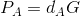, where <strong>dA</strong> is Alice's private key.  
  

## Signature Generation
In this section, we will discuss how signatures are generated using Elliptic Curves.  
  
Like most of the Digital Signature Authentication algorithms,  ECDSA (Elliptic Curve Digital Signature Authentication) too signs the hash of the message rather than the message itself. This makes it convenient to sign even large sized files/documents.  
  
To sign a message:  
1. Calculate hash of the message that you want to sign ie. **e** = HASH(M). Note that HASH() should be a cryptographically secure hash function.
2. Calculate `z` = Ln left most bits of `e`, where Ln is the bit length of `n`
3. Choose a random integer `k` such that 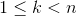
   + k-1 is the modular multiplicative inverse of k modulo n and can be calculated using [Extended Euclid's Algorithm](https://en.wikipedia.org/wiki/Extended_Euclidean_algorithm)
4. Calculate 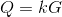
5. Calculate 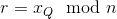
   + Check if r=0, if yes then go back to Step-3
6. Calculate 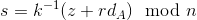
   + Check if s=0, if yes then go to back to Step-3
7. The pair **(r, s)** is the signature
  

Along with the signature pair, there are other values involved in the verification that are public: **e**, **z**, <strong>Q</strong>, **G**, <strong>PA</strong>.
  
  

## Signature Verification
In this section, we will discuss how signatures are verified using Elliptic Curves.  
  
Prior to the verification algorithm, the following conditions must be checked and must hold true:
1. PA must lie on the curve.
2. nPA must be equal to 0, note that 0 is the arbitrary point defined on the Elliptic Curve and is considered to be at infinity and along y-axis
   + We are checking this because PA = dAG and nG=0 (Order of the subgroup generated by G multiplied by G is equal to 0). Hence, nPA=k(nG) = k0 = 0
  

To verify a signature:  
1. Calculate 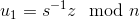
2. Calculate 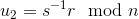
3. Calculate 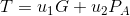
4. The signature is valid only if 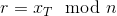, here xT is the x-coordinate of point **T**
  
  

## Correctness of the algorithm
Let us expand Step-3 in the signature verification and then see how the algorithm correctly verifies Alice:  
  
Since, , we can write:  
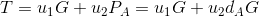  
= 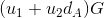  
Expanding u1 and u2 we can write the above equation as:  
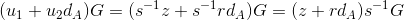  
Substituting `s` we get:  
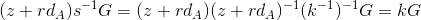  
So, 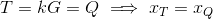  
And hence, 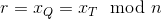
  
  
## Resources
To study more about Elliptic Curves and ECDSA, you can refer to this amazing blog post on ECDSA by Andrea Corbellini- [http://andrea.corbellini.name/2015/05/30/elliptic-curve-cryptography-ecdh-and-ecdsa/](http://andrea.corbellini.name/2015/05/30/elliptic-curve-cryptography-ecdh-and-ecdsa/)  
  
  
## References
1. [ECDSA - Wikipedia](https://en.wikipedia.org/wiki/Elliptic_Curve_Digital_Signature_Algorithm)
2. [Andrea Corbellini's blog](http://andrea.corbellini.name/2015/05/30/elliptic-curve-cryptography-ecdh-and-ecdsa/)