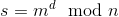

# RSA Signatures with PKCS#1_v1.5 Scheme

Prerequisites:
1. [RSA Encryption/Decryption](https://github.com/ashutosh1206/Crypton/tree/master/RSA-encryption)
2. [Digital Signature using RSA](https://github.com/ashutosh1206/Crypton/tree/master/Digital-Signatures/Unpadded-RSA-Digital-Signatures)
  

Digital signatures using PKCS#1_v1.5 Scheme in RSA protects the signature against Blinding Attack that existed in unpadded RSA signature authentication. In this section, the following topics will be covered:
1. Signing and Verifying messages using PKCS#1 v1.5 Scheme
2. Vulnerabilities and Attacks
  

## Signature Generation
As we know that data is first hashed and then signed using the private key of the one who is signing it, to obtain the signature. This method is vulnerable to Blinding Attack. So PKCS#1 v1.5 Padding Scheme was introduced which also contains a method to sign messages that was resistant to Blinding Attack. The only difference between unpadded signatures and padded signatures is the string that is being exponentiated with `d` ie. in signing of unpadded messages, hash of the message is exponentiated with `d` whereas in case of signing of padded messages, a different string is exponentiated with `d`, as described below:  
  
*Step-1*: We take the hash of the message `M` we want to sign, using a secure hashing algorithm agreed upon by both signer and verifier. Let us call it `HASH`  
*Step-2*: We obtain the string that is to be exponentiated with `d` as  
,  
where the number of `FF` bytes are such that the resultant padded string becomes of around the same size as the modulus `N` and ASN.1 is an encoding signifying the hash algorithm being used, hence specifying size of `HASH` following it. Following is the ASN.1 encoding of various hashing algorithms:  
```python
ASN1 = {  
    '\x30\x20\x30\x0c\x06\x08\x2a\x86\x48\x86\xf7\x0d\x02\x05\x05\x00\x04\x10': 'MD5',
    '\x30\x21\x30\x09\x06\x05\x2b\x0e\x03\x02\x1a\x05\x00\x04\x14': 'SHA-1',
    '\x30\x31\x30\x0d\x06\x09\x60\x86\x48\x01\x65\x03\x04\x02\x01\x05\x00\x04\x20': 'SHA-256',
    '\x30\x41\x30\x0d\x06\x09\x60\x86\x48\x01\x65\x03\x04\x02\x02\x05\x00\x04\x30': 'SHA-384',
    '\x30\x51\x30\x0d\x06\x09\x60\x86\x48\x01\x65\x03\x04\x02\x03\x05\x00\x04\x40': 'SHA-512',
}
```  
Let the resultant string after padding be `m`.  
*Step-3*: We then calculate the signature using the private key generated using the same method in [Unpadded-RSA-Digital-Signatures](https://github.com/ashutosh1206/Crypton/tree/master/Digital-Signatures/Unpadded-RSA-Digital-Signatures) as   
*Step-4*: Send the public key parameters, signature and the message to the Verifier.  
  
Following is a trivial example implementation of how messages are signed using PKCS#1 v1.5:  
```python
def signer(M):
	message = M
	p = getPrime(512)
	q = getPrime(512)
	n = p*q
	phin = (p-1)*(q-1)
	e = 65537
	
	assert GCD(e, phin) == 1
	key = RSA.construct((long(n), long(e)))

	h = MD5.new(M)
	M = PKCS1_v1_5.EMSA_PKCS1_V1_5_ENCODE(h, size(key.n)/8)
	print "Padded M: ", M.encode("hex")
	M = bytes_to_long(M)

	d = inverse(e, phin)
	s = pow(M, d, n)
	s = long_to_bytes(s)
	return (key, s, message)
```
  
  
## Verifying Signatures  
The initial steps are the same as verification in [Unpadded-RSA-Digital-Signatures](https://github.com/ashutosh1206/Crypton/tree/master/Digital-Signatures/Unpadded-RSA-Digital-Signatures), just that after exponentiating the signature with `e` modulo `n`, the verifier checks the padding in the resultant string, since it is supposed to be as per PKCS#1 v1.5 standards. Here is a trivial and vulnerable implementation of the same:  
```python
HASH_ASN1 = {  
    '\x30\x20\x30\x0c\x06\x08\x2a\x86\x48\x86\xf7\x0d\x02\x05\x05\x00\x04\x10'.encode("hex").decode("hex"): 'MD5',
    '\x30\x21\x30\x09\x06\x05\x2b\x0e\x03\x02\x1a\x05\x00\x04\x14'.encode("hex").decode("hex"): 'SHA-1',
    '\x30\x31\x30\x0d\x06\x09\x60\x86\x48\x01\x65\x03\x04\x02\x01\x05\x00\x04\x20'.encode("hex").decode("hex"): 'SHA-256',
    '\x30\x41\x30\x0d\x06\x09\x60\x86\x48\x01\x65\x03\x04\x02\x02\x05\x00\x04\x30'.encode("hex").decode("hex"): 'SHA-384',
    '\x30\x51\x30\x0d\x06\x09\x60\x86\x48\x01\x65\x03\x04\x02\x03\x05\x00\x04\x40'.encode("hex").decode("hex"): 'SHA-512',
}

def _find_method_hash(s):
	for i in HASH_ASN1:
		if s.startswith(i):
			return (HASH_ASN1[i], s[len(i):])
	raise VerificationError('Signature Verification Failed!')

def _get_hash(algo, s):
	if algo == "MD5":
		h = MD5.new()
		h.update(s)
		return h.digest()
	elif algo == "SHA-1":
		h = SHA.new()
		h.update(s)
		return h.digest()
	elif algo == "SHA-256":
		h = SHA256.new()
		h.update(s)
		return h.digest()
	elif algo == "SHA-384":
		h = SHA384.new()
		h.update(s)
		return h.digest()
	elif algo == "SHA-512":
		h = SHA512.new()
		h.update(s)
		return h.digest()
		
def verifier(key, signature, message):
	signature = int(signature, 16)
	e = key.e
	print "e: ", e
	n = key.n
	asn1_data = long_to_bytes(pow(signature, e, n))

	if asn1_data[0] != "\x00":
		asn1_data = "\x00" + asn1_data
	
	if asn1_data[:2] != "\x00\x01":
		raise VerificationError("Signature Verification Failed!")
	else:
		asn1_data = asn1_data[2:]
		index = asn1_data.find('\x00')
		
		if index == -1:
			raise VerificationError("Signature Verification Failed!")
		
		asn1_data = asn1_data[index+1:]
		hash_algo, hash_str = _find_method_hash(asn1_data)
		print hash_algo, hash_str.encode("hex")

		hash_message = _get_hash(hash_algo, message)
		if hash_message != hash_str:
			raise VerificationError("Signature Verification Failed!")
	print "Signature Verified!"
```
  
Verification functions like the one implemented above are vulnerable to [e = 3 Bleichenbacher's Signature Forgery](../Attack-e=3-Bleichenbacher/), we will discuss the attack separately. The vulnerability lies in the fact that the verification function does not check if the padding bytes between `\x00\x01` and `\x00` + `ASN.1` is really `FF` or not, it simply unpads it without checking.  
  
Check out the entire example of signing and verifying messages padded with PKCS#1 v1.5 here- [example.py](example.py).  