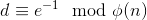
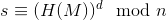
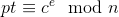
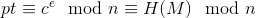

# Unpadded RSA Digital Signatures

Prerequisites:
1. [RSA Encryption/Decryption](https://github.com/ashutosh1206/Crypton/tree/master/RSA-encryption)
  

In this section, the following topics will be covered:
1. How signature authentication differs slightly from encryption in RSA
2. Signing unpadded messages using RSA
3. Verification of signatures using RSA
  

## Signature Authentication using RSA
Suppose Bob wants to authenticate if the person he is going to communicate is really Alice or not. They agree upon a message `M` that Alice will sign and Bob will authenticate. They also agree upon a hashing algorithm that will be used to hash the message `M`. Let us see what happens on each side, ie. Alice (the one who is signing) and Bob's (Verifier) side:  
  
  
**Alice's Side**:  
*Step-1*: Alice calculates the hash of the message `M` to be signed using the algorithm agreed upon, let it be `H(M)`.  
*Step-2*: She then converts the message string `M` to long integer (Can be done using pycrypto)  
*Step-3*: **Key Generation** Generates two large primes `p` and `q` using a *strong* pseudo-random number generator (This step is similar to encryption in RSA).  
*Step-4*: Calculates `n`=`p`*`q`, , a public key exponent `e` and . (e, n) together makes the public key and (d, n) is the private key, which ofcourse, only Alice knows.  
*Step-5*: Alice generates the signature as   
*Step-6*: She then sends this signature along with the message `M`. (e, n) is made public!  
  
Here is a trivial example implementation of signing messages described above:  
```python
def signer(M):
	message = M
	p = getPrime(512)
	q = getPrime(512)
	n = p*q
	phin = (p-1)*(q-1)
	e = 65537
	assert GCD(e, phin) == 1
	d = inverse(e, phin)
	M = md5(M).digest()
	M = bytes_to_long(M)
	s = pow(M, d, n)
	s = long_to_bytes(s)
	return (s, message)
```
  
  
  
**Bob's Side**:  
*Step-1*: Now that Bob has Alice's signature of hash of message `M`, the message `M` and her public key, he can move forward and verify the signature.  
*Step-2*: Bob calculates  and hence will get   
*Step-3*: Now Bob calculates hash of the message `M` as `H(M)` and checks if it matches with `pt` obtained above. If it does match then Bob has verified that the person he is communicating is Alice, if it does not match then verification fails.  
  
Observe carefully that only if one knows the private key, he/she can sign particular string, otherwise the verification will fail. Ofcourse this was what was perceived, we will see how we can forge signatures in case of unpadded messages.  
  
Here again is a trivial example implementation of verifier described above:  
```python
def verifier(pubkey, s, M):
	s = bytes_to_long(s)
	n = pubkey.n
	e = pubkey.e
	M = md5(M).digest()
	pt = pow(s, e, n)
	pt = long_to_bytes(pt)
	if pt == M:
		print "Verified!"
	else:
		raise VerificationError("Verification Failed!")
```
  
Check out the entire example script for message signing and verification [here](example.py).  