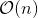
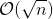
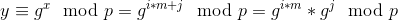
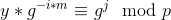
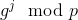
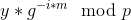

# Baby Step Giant Step Algorithm

**Prerequisites**:
1. [Cyclic Groups](https://github.com/ashutosh1206/Crypton/blob/master/Discrete-Logarithm-Problem/README.md#cyclic-groups)
2. [Discrete Logarithm Problem](https://github.com/ashutosh1206/Crypton/blob/master/Discrete-Logarithm-Problem/README.md)

A method to reduce the time complexity of solving DLP is to use **Baby Step Giant Step Algorithm**. While brute forcing DLP takes polynomial time of the order , Baby Step Giant Step Algorithm can compute the value of `x` in  polynomial time complexity. Here, `n` is the order of the group.

This algorithm is a tradeoff between time and space complexity, as we will see when we discuss the algorithm.

## Algorithm
`x` can be expressed as **x = i*m + j**, where  and `0 <= i,j < m`.

Hence, we have:  
  


We can now use the above property for solving DLP as follows:
1. Iterate `j` in its range and store all values of  with corresponding values of `j` in a lookup table.
2. Run through each possible iteration of `i` and check if  exists in the table (ie. check if  == ).
   + If it does then return **i*m + j** as the value of `x`
   + Else, continue

## Shortcomings
Although the algorithm is more efficient as compared to plain brute-forcing, other algorithms of the same time complexity (Pollard's rho) are used for solving DLPs because of the fact that storing the look up table requires quite a lot of space.

## Implementation
I wrote an implementation of the above algorithm in python/sage:

```python
from sage.all import *

def bsgs(g, y, p):
    mod_size = len(bin(p-1)[2:])

    print "[+] Using BSGS algorithm to solve DLP"
    print "[+] Modulus size: " + str(mod_size) + ". Warning! BSGS not space efficient\n"

    m = ceil(sqrt(p-1))
    # Baby Step
    lookup_table = {pow(g, j, p): j for j in range(m)}
    # Giant Step pre-computation
    c = pow(g, m*(p-2), p)
    # Giant Steps
    for i in range(m):
        temp = (y*pow(c, i, p)) % p
        if temp in lookup_table:
            # x found
            return i*m + lookup_table[temp]
    return None
```
You can check out the complete code here: [bsgs.py](bsgs.py)

## Resources & References
1. [Rahul Sridhar- Survey of Discrete Log Algorithms](https://fortenf.org/e/crypto/2017/12/03/survey-of-discrete-log-algos.html)
