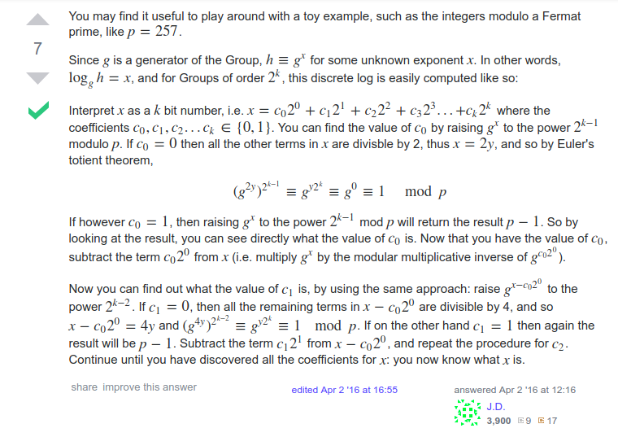
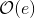

# Pohlig Hellman Algorithm

**Prerequisites**:
1. [Discrete Logarithm Problem](https://github.com/ashutosh1206/Crypton/tree/master/Discrete-Logarithm-Problem)

**Pohlig Hellman Algorithm** is applicable in cases where order of the group, over which DLP is defined, is a smooth number (ie. the number that can be factored into small prime numbers). First, let us define our DLP over the Cyclic Group `G` =  having order `n`.

There are different variations to Pohlig-Hellman algorithm that can be applied in different conditions:
1. When **order** of a group **is a power of 2 only** ie. n = 2e
2. When **order** of a group **is a power of a prime** ie. n = pe, where `p` is a prime number
3. **General algorithm** ie. n = p1e1 p2e2 p3e3... prer

## Order of a group is a power of 2
  
*Source: https://crypto.stackexchange.com/questions/34180/discrete-logarithm-problem-is-easy-in-a-cyclic-group-of-order-a-power-of-two*

I implemented this algorithm in python here: [ph_orderp2.py](ph_orderp2.py)

So if you have a group whose order is a power of 2, you can now solve the DLP in , where `e` is the exponent in the group order n = 2e.

## Order of a group is a power of a prime number

**Source**: [http://anh.cs.luc.edu/331/notes/PohligHellmanp_k2p.pdf](http://anh.cs.luc.edu/331/notes/PohligHellmanp_k2p.pdf)

I implemented this algorithm in python here: [ph_orderpp.py](ph_orderpp.py)

## General Algorithm

**Source**: [http://anh.cs.luc.edu/331/notes/PohligHellmanp_k2p.pdf](http://anh.cs.luc.edu/331/notes/PohligHellmanp_k2p.pdf)

I implemented this algorithm in python/sage here:
[pohlig_hellman.py](pohlig_hellman.py)
