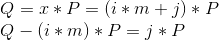
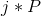
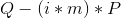

# Baby Step Giant Step Algorithm

**Prerequisites**:
1. [Elliptic Curve Discrete Logarithm Problem](https://github.com/ashutosh1206/Crypton/tree/master/Discrete-Logarithm-Problem/Elliptic-Curve-DLP)

A method to reduce the time complexity of solving DLP is to use **Baby Step Giant Step Algorithm**. While brute forcing DLP takes polynomial time of the order , Baby Step Giant Step Algorithm can compute the value of `x` in  polynomial time complexity. Here, `n` is the order of the subgroup generated by the base point `P` of an Elliptic Curve `E`.

This algorithm is a tradeoff between time and space complexity, as we will see when we discuss the algorithm.

## Algorithm
`x` can be expressed as **x = i*m + j**, where  and `0 <= i,j < m`.

Hence, we have:  
  

We can now use the above property for solving DLP as follows:
1. Iterate `j` in its range and store all values of  with corresponding values of `j` in a lookup table.
2. Run through each possible iteration of `i` and check if  exists in the table (ie. check if  == ).
   + If it does then return **i*m + j** as the value of `x`
   + Else, continue

## Shortcomings
Although the algorithm is more efficient as compared to plain brute-forcing, other algorithms of the same time complexity (Pollard's rho) are used for solving ECDLPs because of the fact that storing the look up table requires quite a lot of space.

## Implementation
I wrote an implementation of the above algorithm in python/sage:

```python
from sage.all import *

def bsgs_ecdlp(P, Q, E):
    if Q == E((0, 1, 0)):
        return P.order()
    if Q == P:
        return 1
    m = ceil(sqrt(P.order()))
    # Baby Steps: Lookup Table
    lookup_table = {j*P: j for j in range(m)}
    # Giant Step
    for i in range(m):
        temp = Q - (i*m)*P
        if temp in lookup_table:
            return (i*m + lookup_table[temp]) % P.order()
    return None
```
You can check out the complete code here: [bsgs_ecdlp.py](bsgs_ecdlp.py)

## Resources & References
1. [Andrea Corbellini- Breaking security and comparison with RSA](https://andrea.corbellini.name/2015/06/08/elliptic-curve-cryptography-breaking-security-and-a-comparison-with-rsa/)
