# Pollard Rho Algorithm for solving ECDLP

**Prerequisites**:
1. [Elliptic Curve Discrete Logarithm Problem](../../Elliptic-Curve-DLP/)

**Pollard Rho Algorithm** for solving ECDLP will give a unique solution in cases where order of the group, over which the DLP is defined, is a prime number. Otherwise, it can give multiple solutions.


To find any two pairs 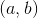 & 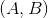 such that  
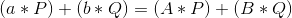

Once we have these pairs, we can write:  
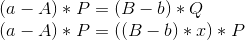

Let base point P have order = n. Then we can write:  
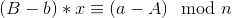  
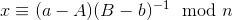, provided GCD((B-b), n) == 1

But the problem is, **how do we calculate (a, b) and (B, b)**?

Brute Forcing such pairs will be of the order 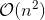 which is even larger than the
brute force algorithm for solving ECDLP: .

We can use Floyd's Cycle Finding Algorithm to reduce the complexity!
Have a look at how the Cycle Finding algorithm can be efficiently used to solve ECDLP:

  
*Source: https://andrea.corbellini.name/2015/06/08/elliptic-curve-cryptography-breaking-security-and-a-comparison-with-rsa/*

Basically, the algorithm is
1. Initially select any integral values for the two pairs 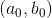, 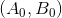
2. Keep calculating 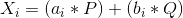 and 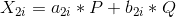,  until 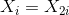
   + Check if 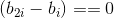,
     + If true, then start again from (1)
     + If false, then return 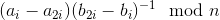 as `x`

## How to calculate , 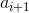, 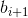

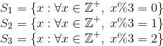


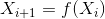

```
Function f(x):

                      /----------------------------------------------------------|
                     /    X_i + Q = a_i*P       + (b_i + 1)*Q   , X_i[0] in S_1  |
func_f() ~ f(X_i) = /     2*X_i   = (2*a_i)*P   + (2*b_i)*Q     , X_i[0] in S_2  |
                    \     X_i + P = (a_i + 1)*P + b_i*Q         , X_i[0] in S_3  |
                     \-----------------------------------------------------------|

```

**Note**: Since 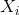 is a point and not an integer, we simply partition using x-coordinate of 

We can conclude from the above formula that the value of 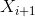 depends upon
the set (S_1, S_2, S_3) to which  belongs.

Now, we need to calculate values of  and . Both of them will also
depend upon the set(S_1, S_2, S_3) to which X_i belongs.

```
Function g(x) and h(x):

                       /--------------------------------|
                      /    a_i         , X_i[0] in S_1  |
func_g() ~ a_(i+1) = /     2*a_i       , X_i[0] in S_2  |
                     \     (a_i + 1)   , X_i[0] in S_3  |
                      \---------------------------------|

                       /--------------------------------|
                      /    (b_i + 1)   , X_i[0] in S_1  |
func_h() ~ b_(i+1) = /     2*b_i       , X_i[0] in S_2  |
                     \     b_i         , X_i[0] in S_3  |
                      \---------------------------------|
```

I implemented the algorithm in python/sage (with appropriate comments/explanation) here: [pollardrho.py](pollardrho.py)


# References
1. [Andrea Corbellini- Pollard's Rho](https://andrea.corbellini.name/2015/06/08/elliptic-curve-cryptography-breaking-security-and-a-comparison-with-rsa/)
2. Section 3.6.3 of [chapter-3 from Handbook of Applied Cryptography](http://cacr.uwaterloo.ca/hac/about/chap3.pdf)
