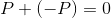
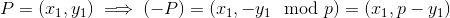
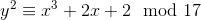
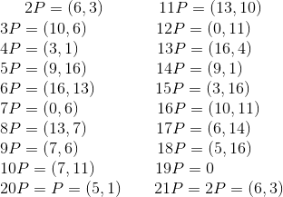
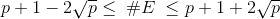
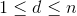

# Elliptic Curve Discrete Logarithm Problem
  
Prerequisites:
1. [Elliptic Curves](https://github.com/ashutosh1206/Crypton/tree/master/Elliptic-Curves)
2. [Discrete Logarithm Problem](https://github.com/ashutosh1206/Crypton/tree/master/Discrete-Logarithm-Problem)
3. [Point Multiplication](https://github.com/ashutosh1206/Crypton/tree/master/Elliptic-Curves)
  
  

To establish a Discrete Logarithm Problem over Elliptic Curves requires the presence of an **identity element** and an **inverse element** along with having closure and cyclic properties. In this section, we will:  
1. Define a cyclic group over points on an Elliptic Curve
   + Identity element
   + Inverse of a point P
2. Discrete Logarithm Problem on Elliptic Curve
   + Hasse's Theorem
   + Defining ECDLP
  

## Defining Cyclic Group over Elliptic Curves

1. **Identity element**: For a point P on an Elliptic Curve, we define another arbitrary point **0** on the elliptic curve such that: 
   + 
   + There does not exist such a point on an Elliptic Curve, so we define the Elliptic Curve to explicitly add the identity element, hence define the Elliptic Curve as the set of all points that lie on the polynomial curve with the arbitrary point. Consider the arbitrary point at  or  along y-axis. 
2. **Inverse of a point**: To satify the group properties, we need another point (-P) for any point P on an Elliptic Curve such that: 
   + 
   + We can solve it geometrically by finding a point which when joined with P, extended to a third point of intersection and reflected along the x-axis, gives the identity element **0**. For a point P=(x1,y1), it's inverse (-P) can be simply calculated as (x1, -y1 mod p). Thus, the inverse of a point P on an Elliptic Curve geometrically is simply a mirror of that point along x-axis!
     + 

We must now check for _cyclic properties_ of the Elliptic Curve, only then will we be able to define Elliptic Curve Discrete Logarithm Problem and ECDH (Elliptic Curve Diffie Hellman Key Exchange):  
  
Consider an Elliptic Curve  of order 19. We will first calculate scalar multiples of a point **P=(5, 1)**, observe different patterns with every result obtained and then draw conclusions.  
  
You can use this awesome tool by Andrea Corbellini to calculate and visualise Scalar Multiplication- [Elliptic Curves Scalar Multiplication](https://cdn.rawgit.com/andreacorbellini/ecc/920b29a/interactive/reals-mul.html)  
  
Here are the results of scalar multiplication:  
  
  
  
**Observations and Conclusions**:  
1. The multiples of P (Scalar Multiplication) cycle after an iterator value, which in our case, is 19. Also, we observe that 20P is equal to P, 21P is 20P+P making it equal to 2P, 22P is equal to 3P and so on.
   + We can conclude that scalar multiples of any point P are closed under addition, this means that sum of multiples of P (Assume sum of 2P and 3P), will again lie in the set of multiples of P (2P + 3P = 5P) and on the curve.
2. If we take another point and calculate it's scalar multiples, it is not necessary that the number of multiples of P just before hitting the cycle repetition will be equal to the order of an Elliptic Curve. This property is similar to that of cyclic groups over  (Remember construction of a DLP?).
   + However, in our example, scalar multiples of any point lying on the Elliptic Curve will always be in cycles of 19, we will find the reason for this pattern, soon! To verify this property you can use this [tool](https://cdn.rawgit.com/andreacorbellini/ecc/920b29a/interactive/reals-mul.html) to calculate and visualise scalar multiples of a point on an Elliptic Curve.
3. Now that we have proved that the set of multiples generated by point P is closed under addition and is cyclic, we can conclude that it is a subgroup of the group containing elements equal to the order of the Elliptic Curve.
   + Why _subgroup_? Because as mentioned earlier, it is not necessary that the number of multiples of P in it's cycle will be equal to the order of an Elliptic Curve. Anyway, the set of multiples follow closure and cyclic properties required for it to be a cyclic subgroup!
  
  

**Subgroups and Order**:  
1. Order of a point P lying on an Elliptic Curve is defined as the _smallest positive integer_ `n` such that **nP = 0**.
2. We know that order of any Cyclic Group is equal to the number of elements generated by it's generator element. But order of a subgroup generated might not be equal to order of it's generator element. 
   + We need to define order of subgroup generated by a point P on multiplication with a scalar. We cannot use Schoof's Algorithm to calculate order of a subgroup as it only works when _all the points_ on an Elliptic Curve are generated.
   + For Cyclic Groups generated by the DLP  over  we know that the number of elements generated by an element `a` will be a factor of order of the group. We have a theorem for it, known as [Lagrange's Theorem](https://en.wikipedia.org/wiki/Lagrange%27s_theorem_(group_theory)) and this theorem can be applied to Elliptic Curves as well. 
     + Lagrange Theorem- For any finite group `G`, the order of every subgroup `H` of `G` divides order of `G`. You can check out a proof of this theorem here- [Proof of Lagrange's Theorem](https://en.wikipedia.org/wiki/Lagrange%27s_theorem_(group_theory)#Proof_of_Lagrange%27s_theorem)
3. Calculating order of a subgroup generated by P is fairly simple now- 
   + Calculate the order of the Elliptic Curve- let it be `n`
   + Append all the factors of `n` into a list 
   + Check for every element ni in the list if niP=0
     + If yes then ni is the order of the subgroup generated by P.
4. Now, we can answer this question- why in the case of the illustrated Elliptic Curve , were the scalar multiples of any point lying on the curve in cycles of 19 only?
   + This is because 19 is the order of the group and is a prime number too; and since order of a subgroup is a factor of the order of the group, we have the possible orders of the subgroup = 1, 19. 1 cannot be the order, hence 19 is the order of the subgroup generated by any point P on the given Elliptic Curve.
  
  
  
  

## Elliptic Curve Discrete Logarithm Problem
DL cryptosystems can be viewed from two different view-points:
1. Constructing DLP on Elliptic Curves
2. Breaking DLP (Attacker's motive)
  

**Constructing DLP on Elliptic Curves**:  
To set up a Discrete Logarithm it is important to know order of the Elliptic Curve. While we know that it can be directly calculated using Schoof's Algorithm, we can still estimate it by using Hasse's Theorem.  
1. Hasse's Theorem- This theorem provides an estimate bound of the number of points on an Elliptic Curve over a Finite Field, by giving both the upper and lower bounds.
   + If #E denotes the number of points on an Elliptic Curve E modulo p, then #E is bounded by:
     + 
2. To setup a DLP:
   + Consider a primitive element `P` 
   + Choose a private key `d` such that , where `n` is the order of the subgroup generated by `P`
   + Calculate 
  
  

**Breaking DLP defined on Elliptic Curves**:  
Consider a situation in which we know `P` and `Q` that satisfy , where `d` is a scalar  and is also the private key whose value is not known to the attacker.  
The Discrete Logarithm Problem for Elliptic Curves is finding the integer `d` that satisfies the equation given above.  
  
This problem is considered a _hard_ problem, and the algorithms that can be used to solve it on Elliptic Curves work under very specific scenarios, but we can reduce the complexity by a factor in some cases. We will discuss each and every algorithm used to solve ECDLP in detail, in the next section.  
  
  
  
  
  

## Resources

