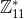
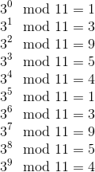
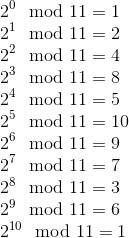
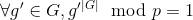
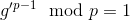
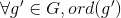
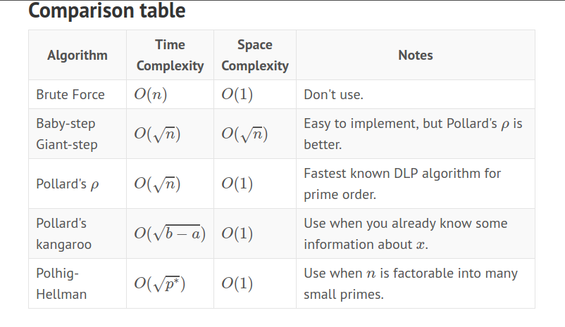
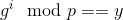

# Discrete Logarithm Problem

Prerequisites:
1. Mathematical Structures- Groups, Rings, Fields

In this section, all the topics will be discussed with reference to normal arithmetic operations. [Discrete Logarithm Problem for Elliptic Curves](Elliptic-Curve-DLP/) is discussed separately.

## Cyclic Groups
Abelian Groups in which all the elements of the group can be generated using a single element in the group, by modular exponentiation is known as Cyclic Groups. This element is known as the *generator* and in most cases, is denoted by `g`. This definition is a bit abstract, so let us try to understand Cyclic Groups with the help of an example:  

Let  be a finite group over multiplication having order = 10 (Order of a group is the number of elements present in it). We know that the elements of this group are: **{1, 2, 3, 4, ..., 10}**

Consider an element `g'` in the group, let us suppose it to be `equal to 3`. If we compute all the powers of `g'` in this group and note the remainders. We will get:  


Some observations:
1. Notice that after exponent = 4, the values started repeating
2. If we continue raising the power further, the values keep on repeating, like a cycle
3. We can also observe that `g'` = 3 only generates 5 elements of the group {1, 3, 9, 5, 4}

This property of having **cyclic repetition** of values, is what makes a group cyclic! But this is not sufficient to make a Cyclic Group. Another requirement is the **presence of a generator**.

Since `3` only generates 5 elements of the group, we need to find some element, which when exponentiated in the group, generates all the elements in the group.

Let us now try and calculate the remainders of modular exponentiation in the group with `g'` = 2. We will have:  


2<sup>11</sup> mod 11 will again be equal to 2

We have been able to produce the entire group   using a single element `g'` = 2. Hence, `2` is the generator of .

Let us now formally define a few properties based on our observations *for a cyclic group G*:  
1. **Order of an element ord(g')**: order of an element `g'` in a Cyclic Group (G, o) is the smallest positive integer k such that: g'<sup>k</sup> = `g'` o `g'` o `g'` o … o `g'` (k times) = `e`, where `e` is the identity element of group `G` and **o** is the operator
   + In the case of algebraic cyclic groups, **o** operator is algebraic multiplication
   + In the case of Elliptic Curves, **o** operator is point addition
2. For every prime `p`,  is a Cyclic Group.
3. , where |G| is the number of elements in the group.
   + In the case of , |G| = p-1. Hence, we can write: . This is known as **[Fermat's Little Theorem](https://en.wikipedia.org/wiki/Fermat%27s_little_theorem)**.
4. **Lagrange's Theorem**:  divides |G|. In other words, the number of elements generated by any element in the group divides the total number of elements in the group.
   + For example, if we consider , ord(3) = 5 divides 10 which is the total number of elements in the group. Similarly ord(2) = 10 too divides 10.


## Discrete Logarithm Problem
Discrete Logarithm Problem is the problem of solving for `x` in the equation:  defined in the Cyclic Group `G`=, knowing the value of `y`, `g` and `p`.
+ It is not necessary that `p` has to be a prime, but to avoid any complications, in most cases, `p` is a prime number.
+ Note that `y`, `x`, `g` belong to the group `G`, hence their values are restricted to elements in that corresponding group only.

There are a number of algorithms that are favourable in solving DLPs under different circumstances:
1. Brute Force - the most trivial algorithm
2. [Baby Step Giant Step Algorithm-BSGS](Algo-Baby-Step-Giant-Step/)
3. [Pollard's Rho Algorithm](Algo-Pollard-Rho/) - Space efficient, unlike BSGS
4. [Pohlig Hellman Algorithm and it's variations](Algo-Pohlig-Hellman/) - When p-1 is a smooth number
5. [Pollard's Kangaroo Algorithm]() - When some info about `x` is known - **To be added**

  
*Source: [Rahul Sridhar- Survey of DLP](https://fortenf.org/e/crypto/2017/12/03/survey-of-discrete-log-algos.html)*

We will discuss the Brute Force Algorithm in this write-up itself, rest of the algorithms have been covered separately in this directory.

## Brute Force
In this algorithm all you have to do is iterate over all the possible values of `x` starting from i=`2` to i=`p-2` and check in each iteration if . As soon as the condition hits true, return the corresponding value of `i` as `x`. Polynomial time complexity: 

I have written an implementation (memoized) of this trivial algorithm:
```python
def brute_dlp(g, y, p):
    mod_size = len(bin(p-1)[2:])

    print "[+] Using Brute Force algorithm to solve DLP"
    print "[+] Modulus size: " + str(mod_size) + ". Warning! Brute Force is not efficient\n"

    sol = pow(g, 2, p)
    if sol == y:
        return 2
    if y == 1:
        return p-1
    if y == g:
        return 1
    for i in range(3, p-1):
        sol = sol*g % p
        if sol == y:
            return i
    return None    
```
You can check out the complete code here: [brute.py](brute.py)

## Resources & References:
1. [Youtube- DH and DLP- Christof Paar](https://www.youtube.com/watch?v=aeOzBCbwxUo&list=PL6N5qY2nvvJE8X75VkXglSrVhLv1tVcfy&index=13)
2. [Youtube- Generalised DLP and Attacks- Christof Paar](https://www.youtube.com/watch?v=IGqrbM52wtg&list=PL6N5qY2nvvJE8X75VkXglSrVhLv1tVcfy&index=14)
3. [Wikipedia- Discrete Logarithm Problem](https://en.wikipedia.org/wiki/Discrete_logarithm)
4. [Rahul Sridhar- Survey of Discrete Logarithm Problem](https://fortenf.org/e/crypto/2017/12/03/survey-of-discrete-log-algos.html)
