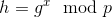
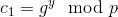
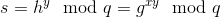
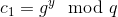
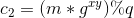
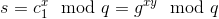
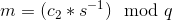

# ElGamal Encryption
  
Prerequisites:
1. Cyclic Groups, Generators
2. Basic Number Theory (Euler's Theorem, Fermat's Little Theorem)
  
  

ElGamal Encryption System is an Asymmetric Key Encryption System based on Discrete Logarithm Problem (DLP) and Diffie-Hellman Key Exchange. Like every other Public Key encryption, it has a public and a private key, we will see that as we move forward.  
For illustrative purposes, we will consider `Alice` as the receiver and `Bob` as the sender.  
  
There are different steps involved while encrypting/decrypting data with ElGamal, let's list them first and then study each of them in detail:  
1. **Key Generation**:  Alice generates a pair of public and private keys. Shares the public key.
2. **Encryption**: Bob uses Alice's public to encrypt message that he wants to send to Alice, and hence generates a pair of ciphertext (c1, c2). Shares the ciphertext pair.  
3. **Decryption**: Alice then uses his private key to decrypt the ciphertext (c1, c2).
  
  

## Key Generation
This is the first step in the process of transferring a messages securely, between Alice and Bob. In this step, Alice does the following: 
1. Selects a Cyclic Group `G` of order `q` and generator `g`
2. Selects a random number `x` such that `1 <= x <= q-1`
3. Calculates 
4. Shares `h`, `g`, `q` as Public Key
5. `x` is the Private Key which only Alice should know, and that's where the security of the encryption system lies.
  

Here is a python-2.7 implementation of the above step:  
```python
from Crypto.Util.number import *
import random

def generate_key(size):
	p = getPrime(size)
	x = random.randint(2, p-2)
	g = 2
	h = pow(g, x, q)
	return (h, g, q)
```
  
  

## Encryption
Bob receives Alice's Public Key and encrypts the message that he wants to send to Alice as follows:  
1. Selects a random number `y` --> {1, ..., q-1}
2. Chooses a message `m` such that `1 <= m < q-1`
2. Diffie Hellman Step: Calculates  
3. Diffie Hellman Step, also `s` is known as the shared secret: Calculates 
4. Calculates 
5. Shares (c1, c2) as the ciphertext
  

Here is a python-2.7 implementation of the above step:  
```python
from Crypto.Util.number import *
import random

def encrypt(message, h, g, q):
	message = bytes_to_long(message)
	y = random.randint(2, p-2)
	c1 = pow(g, y, q)
	s = pow(h, y, q)
	c2 = (m*s) % q
	return (c1, c2)
```

  
  

## Decryption
Alice receives (c1, c2), we can write them as:  
  
  
Alice then calculates the following to get the shared secret `s`:   
To get back the message `m` from c<sub>2</sub>, Alice does the following:  
  
  

Here is a python-2.7 implementation of the above step:  
```python 
from Crypto.Util.number import *
import random

def decrypt(c1, c2, g, q, x):
	s = pow(c1, x, q)
	m = (c2*inverse(s, q)) % q
	return m
```
  
Check out the complete trivial implementation/example of ElGamal encryption/decryption [here](example.py)

## References
1. [Wikipedia- ElGamal Encryption](https://en.wikipedia.org/wiki/ElGamal_encryption)