# Elliptic Curves
  
Prerequisites:
1. [Finite Fields](https://en.wikipedia.org/wiki/Finite_field)
2. [Cyclic Groups](https://masterpessimistaa.wordpress.com/2018/01/14/dlp-and-baby-step-giant-step-algorithm/)
3. [Discrete Logarithm Problem](../Discrete-Logarithm-Problem)

To start with Elliptic Curve Cryptography we will first have to see various aspects involved in it. This tutorial is an attempt to help people understand Elliptic Curves better and dive deeper into the concepts of ECC as we move forward step by step. This tutorial includes implementation and explanation of the following:
1. Defining Elliptic Curves
2. Mathematics behind Elliptic Curves (painful?)
   + Point Arithmetic
     + Dot operation or Point Addition
     + Point Doubling
   + Scalar Multiplication
     + Optimisation algorithms- how have they improved over the years
  
  

## Elliptic Curves- definition
Consider the polynomial 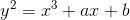. All the solutions of this polynomial, when plotted in a graph will look something like this:  
  
This polynomial has some very interesting properties and a modified version of this polynomial is used for cryptographic purposes. Elliptic Curves provide security with relatively smaller key sizes when compared to other public key systems such as RSA, Discrete Logarithm Problem, Diffie Hellman Key Exchange etc. The original polynomial mentioned above is not used directly, as it is favorable to have the curve over a finite set (particularly Finite Fields) than to have it defined over real numbers, for cryptographic purposes. We will see one such popular form of the polynomial which is used as an Elliptic Curve, and can be defined over 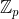 as the following:  
  
> An Elliptic Curve over  with p>3, is the set of all pairs (x, y) in  that satisfy , along with an arbitrary value, where 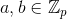
  

In this tutorial, we will first define operations on Elliptic Curve over _real numbers_ and then formulate the same for Elliptic Curves over _Finite Fields_.  
We will also see in the next few sections how Elliptic Curve is a better trapdoor function than other existing systems of Public Key Crypto.  
  
  

## Notable observations about EC polynomial
1. The curve is symmetric with respect to x-axis: 
   + 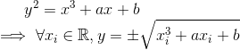
2. The curve of the polynomial intersects x-axis at exactly one point, implying that there exists only one real solution to the cubic equation:
   + 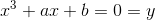
  
  

## Point Addition
In this section, we will define addition of two points lying on an Elliptic Curve. Please note that some people use a `dot` operator instead of referring to it as `addition` operation, the operator used to denote the operation could be different, but the operation is still the same.  
  
Also, `+` is just a notation that we use to denote the operation that we do on two points on an Elliptic Curve, it is not really addition that we do on the two points.  
  
Assume two points A=(x<sub>1</sub>, y<sub>1</sub>) and B=(x<sub>2</sub>,y<sub>2</sub>) lying on the curve of the polynomial . We define C(x<sub>3</sub>, y<sub>3</sub>) as:  
  
  
We can calculate `C` geometrically with the help of following steps:  
> 1. Draw a line from A to B and get a third point of intersection extending the line and on the curve.
> 2. Reflect the point obtained along the x-axis and on the curve. This mirrored point is point C.
  

To understand it better have a look at this GIF below taken from Nick Sullivan's blog post on Elliptic Curves- [https://blog.cloudflare.com/a-relatively-easy-to-understand-primer-on-elliptic-curve-cryptography/](https://blog.cloudflare.com/a-relatively-easy-to-understand-primer-on-elliptic-curve-cryptography/):
  
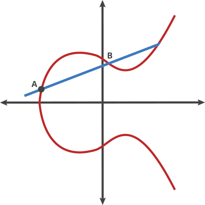  
  
Now that we have defined point addition geometrically, let us formulate the same arithmetically with the help of observations noted from geometric definition of point addition:  
1. We know that A, B, C' (C' is the reflection of point C along x-axis) lie on the curve as well the line joining A=(x<sub>1</sub>, y<sub>1</sub>), B=(x<sub>2</sub>,y<sub>2</sub>). Our approach will be to first calculate the coordinates of C' and then we can simply negate the y-coordinate of C' keeping the x-coordinate as it is to get coordinates of C. We can write:  
   + 
   + For (x<sub>1</sub>, y<sub>1</sub>), 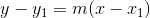, where `m` is the slope of the line connecting A and B.
   + Thus, we have
     + 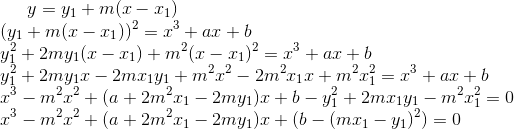
   + We know that (x-x<sub>1</sub>) and (x-x<sub>2</sub>) are factors of the above cubic equation obtained, and also we can write from [Vieta's Formula](https://en.wikipedia.org/wiki/Vieta%27s_formulas) that for a polynomial `P(x)` defined as: 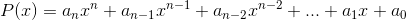, sum of the roots 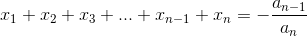. Hence we can write for a cubic polynomial that 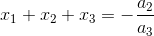 which in case of our polynomial can be written as 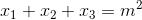. We know x<sub>1</sub>, x<sub>2</sub> and m<sup>2</sup> so we can calculate x<sub>3</sub> as:  
     + 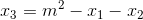 --> Using this formula we can calculate the x-coordinate of C'
   + Now that we have the x-coordinate of C', we can use it to calculate the y-coordinate of C' as well. Note that point C does not lie on the line joining A and B, but the reflection of point C on x-axis lies on the line joining A and B ie. point C'; the x-coordinate of point C remains the same, while the y-coordinate is just negated. Since point A and C' lie on the same line, we can write:
     + 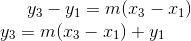

Now that we have calculated (x, y) coordinates of C', we can write coordinates of C as:  
> 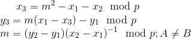  
> Notice that we added (mod p) in calculation as our curve is defined over the Finite Field  and not over Real Numbers
  

Let us implement point addition on python-2.7:
```python

```
  
  
## Point Doubling
Point Doubling is similar to Point Addition, just that the formula for calculating slope is different, rest of the formulae for getting the coordinates of x<sub>3</sub> and y<sub>3</sub> are the same. We will first define point doubling geometrically and then define it arithmetically. Please note here `doubling` is just a notation, the operation that takes place on point lying on the curve is very different from normal doubling.  
  
Consider a point P=(x<sub>3</sub>, y<sub>3</sub>) that we want to `double`. We can calculate 2P with the help of following steps:
> 1. Draw a tangent on the curve through P and obtain a second point of interesection between the curve and the line. 
> 2. Reflect the point obtained along the x-axis and on the curve. This mirrored point is 2P.
  

  
  

We can also understand it using Point Addition: Consider addition two points P and Q on an Elliptic Curve, as Q approaches P, the line joining the two points to `add` these points approaches closer and as Q becomes very very close to P, the line becomes a tangent at point P.  
  
Arithmetically, we can express coordinates of 2P as:  
> 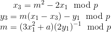  
> Here m is the slope of the tangent passing through P
  

Let us implement point doubling on python-2.7:
```python

```
  
## Resources
There are some pretty cool resources on ECC which you can refer:  
1. [Nick Sullivan's blog post on Elliptic Curves](https://blog.cloudflare.com/a-relatively-easy-to-understand-primer-on-elliptic-curve-cryptography/)
2. [Introduction to Cryptography by Christof Paar- Introduction to Elliptic Curves](https://www.youtube.com/watch?v=vnpZXJL6QCQ)
3. [Introduction to Cryptography by Christof Paar- Elliptic Curve Cryptography](https://www.youtube.com/watch?v=zTt4gvuQ6sY)
  
  

## References
1. Picture/GIF reference: https://blog.cloudflare.com/a-relatively-easy-to-understand-primer-on-elliptic-curve-cryptography/