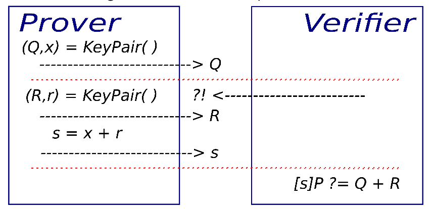
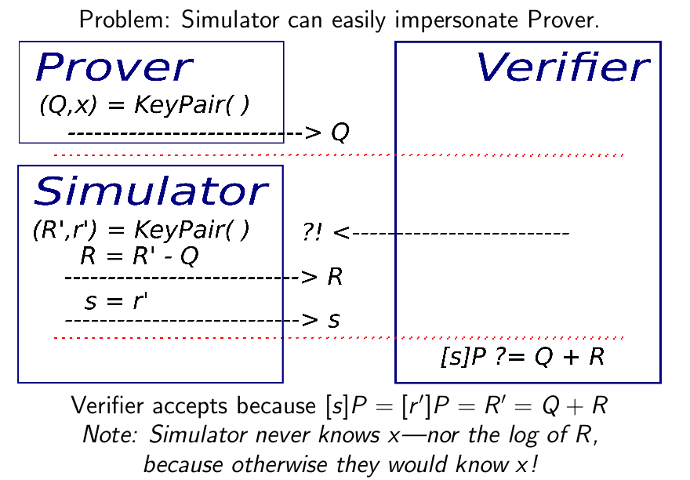
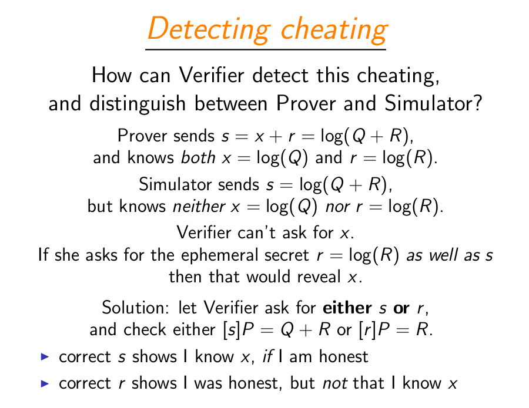

# Ephemeral Key Authentication

**Prerequisites**:
1. [Elliptic Curve Arithmetic](https://github.com/ashutosh1206/Crypton/tree/master/Elliptic-Curves)
2. [Basics of Identification](../README.md)

In this section, we will discuss:
1. The method of using Ephemeral Keys with Elliptic Curve Arithmetic for Identification
   + Computation on Prover's and Verifier's side
2. Analyse the security of this algorithm
   + Identity Forgery

In the process of identification, an individual can play one of the three roles:
1. **Prover** (Pr): wants to prove his/her identity
2. **Verifier** (Ve): wants to verify Prover's identity
3. **Simulator** (Si): wants to impersonate Prover's identity

## Identification Algorithm
  
*Identification using Ephemeral Keys, Source: [Benjamin Smith- Introduction to Elliptic Curve Cryptography \(ECC 2017\)\[Page 11\]](https://ecc2017.cs.ru.nl/slides/ecc2017school-smith.pdf)*

**Note**: \* symbol mentioned in this section is the symbol for scalar multiplication in Elliptic Curves and not algebraic multiplication. Also, + symbol mentioned in this section is the symbol for [point addition in Elliptic Curves](https://github.com/ashutosh1206/Crypton/tree/master/Elliptic-Curves#point-addition) unless stated otherwise.

Identification Process:
1. Both Prover and Verifier agree upon a Point `P` on an Elliptic Curve `E`, that can serve as a base point for identification algorithm.
2. Prover generates `Q` = x \* P, where `x` is prover's secret key and `P` is the base point
3. Verifier receives point `Q`, sends an acknowledgement indicating so.
4. Prover then generates a random number `r` using a cryptographically secure pseudo random number generator (CSPRNG) and computes R = r \* P, where `P` is the base point.
5. Prover then sends point `R` and `s` = x + r to the Verifier. Here `+` symbol denotes arithmetic addition
6. After receiving `R` and `s`, verifier computes s \* P (Scalar Multiplication) and Q + R (Point Addition) and checks if both of the computations have the same result. If yes, then the verification is successful, if not, then the verification fails.
   + `s * P` = `(x + r) * P` = `x*P + r*P` = `Q + R`
7. `s` does not reveal anything about `x` since `r` is generated using a cryptographically secure pseudo random number generator.

This algorithm looks secure as there is no way an attacker can get the value of `x`, but can we forge the identity without knowing the value of `x`? In the next section, we will discuss how to attack the algorithm and successfully forge an identity!

## Forging Identity
  
*Identity forgery in Ephemeral Key Authentication, Source: [Benjamin Smith- Introduction to Elliptic Curve Cryptography \(ECC 2017\)\[Page 12\]](https://ecc2017.cs.ru.nl/slides/ecc2017school-smith.pdf)*

## Detecting Cheating
  
*Detecting Cheating by checking if the prover knows both `s` and `r`, Source: [Benjamin Smith- Introduction to Elliptic Curve Cryptography \(ECC 2017\)\[Page 13\]](https://ecc2017.cs.ru.nl/slides/ecc2017school-smith.pdf)*

# References
1. [Benjamin Smith- Introduction to Elliptic Curve Cryptography \(ECC 2017\)\[Page 9-17\]](https://ecc2017.cs.ru.nl/slides/ecc2017school-smith.pdf)
