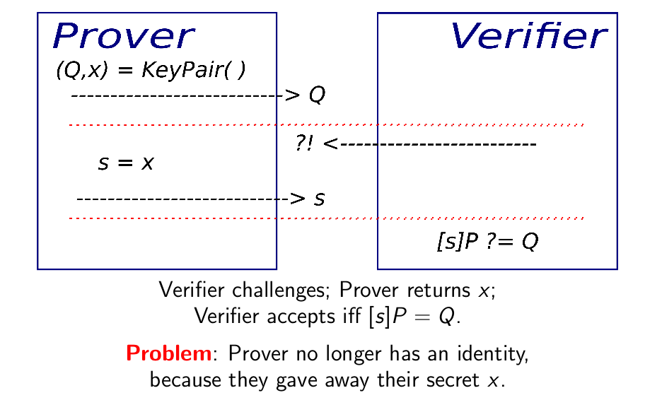

# Identification

**Prerequisites**:
1. [Elliptic Curves and Elliptic Curve Arithmetic](https://github.com/ashutosh1206/Crypton/tree/master/Elliptic-Curves)
2. [Elliptic Curve Discrete Logarithm Problem](../Discrete-Logarithm-Problem/Elliptic-Curve-DLP/)

Digital Identity means that you have a unique key that no one else has, and can be used to identify you online. In this section, we will discuss various aspects of digital identity:
1. Applications, Significance
2. Different algorithms for Identification
   + Identification using Elliptic Curve Arithmetic
3. Identification Forgery

In order to start communicating with a person online, you need to make sure that the person you are establishing a communication channel with, is actually the person you want to communicate and not some attacker trying to steal your personal data. And this can be ensured using a unique key (a.k.a. private key) that can act as a digital identity alloted to each person online.

This unique key, as the name suggests is unique for every individual and is supposed to be kept secret since the key acts as an identifier of a person on the internet. Consider this similar to the DNA when comparing it with the physical world.

Now, what if some person `A` has exactly the same DNA as yours? Then theoretically one can say that you and `A` are the same person. Similarly, if an attacker `E` is able to somehow steal this unique key (a.k.a private key, since it is only known to you), then `E` can impersonate you online, which can be very dangerous.

In the process of identification, an individual can play one of the three roles:
1. **Prover** (Pr): wants to prove his/her identity
2. **Verifier** (Ve): wants to verify Prover's identity
3. **Simulator** (Si): wants to impersonate Prover's identity

A difference between Identification and Digital Signature is that the process of identification is interactive but the process of authentication through Digital Signature is non-interactive.

## Algorithms for identification
There are various algorithms that can be used for identification:
1. Identification using **Elliptic Curve Arithmetic**
   + Trivial Implementation
   + [Using Ephemeral Keys](Ephemeral-Key-Auth/)
     + Breaking Ephemeral Key Authentication
     + Detecting cheating
   + Chaum-Evertse-Graff - TBA
   + Schnorr ID - TBA

### Trivial Algorithm
In this section, we will discuss:
1. A trivial algorithm for identification, using the concept of Elliptic Curves
2. Drawbacks of this method
3. Why this algorithm should not be used practically

  
*Trivial Algorithm for Identification, Source: [Benjamin Smith- Introduction to Elliptic Curve Cryptography \(ECC 2017\)\[Page 10\]](https://ecc2017.cs.ru.nl/slides/ecc2017school-smith.pdf)*

**Note**: \* symbol mentioned in this section is the symbol for scalar multiplication in Elliptic Curves and not algebraic multiplication.

Identification process:
1. Both Prover and Verifier agree upon a Point `P` on an Elliptic Curve `E`, that can serve as a base point for identification algorithm.
2. Prover generates point `Q` = x \* P, where `x` is prover's secret key and `P` is the base point.
3. Verifier receives point `Q`, sends an acknowledgement indicating so.
4. Prover sends `s = x` to the verifier.
5. **Verification Step**: Verifier checks if s \* P is equal to `Q`, if so, then the verification is successful, if not, then the verification process fails.
   + We know that s = x, hence `s * P` = `x * P` = `Q`.

Notice that in this process, the prover `Pr` reveals the value of `x` to the Verifier `Ve`, making the process obsolete. Why? Becaue `Ve` can now impersonate `Pr`. Due to these reasons, this algorithm is not used for verification, we need a more secure algorithm for identity verification process!

# References
1. [Benjamin Smith- Introduction to Elliptic Curve Cryptography \(ECC 2017\)\[Page 9-17\]](https://ecc2017.cs.ru.nl/slides/ecc2017school-smith.pdf)
