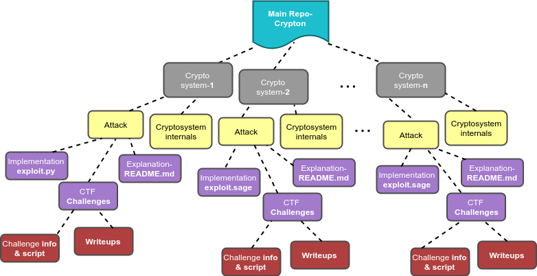

# Crypton

Crypton is an educational library to **learn** and **practice** Offensive and Defensive Cryptography. It is basically a collection of explanation and implementation of all the existing vulnerabilities and attacks on various Encryption Systems (Symmetric and Asymmetric), Digital Signatures, Message Authentication Codes and Authenticated Encryption Systems. Each attack is also supplemented with example challenges from "Capture The Flag" contests and their respective write-ups. Individuals who are already acquainted (or are into CTFs) with this field can use Crypton as a tool to solve challenges based on a particular existing vulnerability.  

The library will be continuously updated with attack explanations and CTF challenges! Feel free to [email me](https://github.com/ashutosh1206/Crypton#author) regarding any suggestions!

I have written a blog post on the timeline of development of this library: [https://masterpessimistaa.wordpress.com/2018/08/12/announcing-crypton-an-educational-library-to-learn-offensive-and-defensive-cryptography/](https://masterpessimistaa.wordpress.com/2018/08/12/announcing-crypton-an-educational-library-to-learn-offensive-and-defensive-cryptography/)  

**WARNING**: The author in no way guarantees that the code is secure. The library is only meant for educational purposes and the code should not be used for implementing in real world. All the example scripts in the library are *trivial* implementations.  

There are different sections in this README:  
* _Motivation_- What motivated me to create this library
* _Library Structure_- Directory structure of Crypton
* _Domain Coverage_- What all cryptosystems and attacks are covered in this library
* _Future Plans/TODO_- Attacks/concepts that are to be included soon

---
## Motivation
Help CTF players and individuals interested in the field of Cryptography provide a platform for learning attacks in crypto and for experienced CTF players to practice challenges systematically divided into attacks associated with different sub-domains in crypto. Also, illustrate through various attack explanations how proper implementation of protocols is crucial.

---
## Library Structure

  

---

## Domain Coverage

### 1. Block Ciphers

| S.No. | Topic                       | Explanation                                                                                     | Impl./Exploit | Challenge# |
|-------|:---------------------------:|:-----------------------------------------------------------------------------------------------:|:------------:|:----------:|
| 1     | [Block Cipher Basics](https://github.com/ashutosh1206/Crypton/tree/master/Block-Cipher#block-cipher)- working of block ciphers, padding etc.| <ul><li>- [x] [\[link\]](https://github.com/ashutosh1206/Crypton/blob/master/Block-Cipher/README.md)</li></ul>| <ul><li>- [ ] </li></ul>         | <ul><li>- [ ] </li></ul>   |
| 2     | [Modes of Encryption](https://github.com/ashutosh1206/Crypton/tree/master/Block-Cipher/Mode-of-Encryption)- different modes of operation on block ciphers: ECB, CBC, CTR | <ul><li>- [x] [\[link\]](https://github.com/ashutosh1206/Crypton/blob/master/Block-Cipher/Mode-of-Encryption/README.md)</li></ul>| <ul><li>- [ ] </li></ul> | <ul><li>- [ ] </li></ul> |
| 3     | [Block Size Detection](https://github.com/ashutosh1206/Crypton/tree/master/Block-Cipher#block-size-detection)- detect blocksize of a block cipher encrypting data on a remote service| <ul><li>- [x] [\[link\]](https://github.com/ashutosh1206/Crypton/tree/master/Block-Cipher#block-size-detection)</li></ul>| <ul><li>- [ ] </li></ul> | <ul><li>- [ ] </li></ul> |
| 4     | [Mode Detection](https://github.com/ashutosh1206/Crypton/tree/master/Block-Cipher#mode-detection)- detect type of mode of encryption: independent or dependent encryption of blocks| <ul><li>- [x] [\[link\]](https://github.com/ashutosh1206/Crypton/tree/master/Block-Cipher#mode-detection)</li></ul>| <ul><li>- [ ] </li></ul> | <ul><li>- [ ] </li></ul> |
| 5     | [ECB Byte at a Time](https://github.com/ashutosh1206/Crypton/tree/master/Block-Cipher/Attack-ECB-Byte-at-a-Time)- byte at a time decryption of a `secret` string running on a remote service encrypting `input`+`secret` in ECB mode| <ul><li>- [x] [\[link\]](https://github.com/ashutosh1206/Crypton/blob/master/Block-Cipher/Attack-ECB-Byte-at-a-Time/README.md)</li></ul>| <ul><li>- [ ] </li></ul> | <ul><li>- [x] [\[link\]](https://github.com/ashutosh1206/Crypton/tree/master/Block-Cipher/Attack-ECB-Byte-at-a-Time/Challenges) </li></ul> |
| 6     | [CBC IV Detection](https://github.com/ashutosh1206/Crypton/tree/master/Block-Cipher/CBC-IV-Detection)- detect the value of Initialisation Vector on a remote service that is encrypting our input using a block cipher in CBC mode| <ul><li>- [x] [\[link\]](https://github.com/ashutosh1206/Crypton/blob/master/Block-Cipher/CBC-IV-Detection/README.md) </li></ul>| <ul><li>- [x] [\[link\]](https://github.com/ashutosh1206/Crypton/blob/master/Block-Cipher/CBC-IV-Detection/example.py) </li></ul> | <ul><li>- [ ] </li></ul> |
| 7     | [CBC Bit Flipping Attack](https://github.com/ashutosh1206/Crypton/tree/master/Block-Cipher/Attack-CBC-Bit-Flipping)- exploiting cookie generation mechanism to login as admin when cookie is generated using a block cipher in CBC mode| <ul><li>- [x] [\[link\]](https://github.com/ashutosh1206/Crypton/blob/master/Block-Cipher/Attack-CBC-Bit-Flipping/README.md) </li></ul>| <ul><li>- [ ] </li></ul> | <ul><li>- [x] [\[link\]](https://github.com/ashutosh1206/Crypton/tree/master/Block-Cipher/Attack-CBC-Bit-Flipping/Challenges) </li></ul> |
| 8     | [CBC Byte at a Time](https://github.com/ashutosh1206/Crypton/tree/master/Block-Cipher/Attack-CBC-Byte-at-a-Time)- byte at a time decryption of a `secret` string running on a remote service encrypting `input`+`secret` in ECB mode| <ul><li>- [x] [\[link\]](https://github.com/ashutosh1206/Crypton/blob/master/Block-Cipher/Attack-CBC-Byte-at-a-Time/README.md) </li></ul>| <ul><li>- [x] [\[link\]](https://github.com/ashutosh1206/Crypton/blob/master/Block-Cipher/Attack-CBC-Byte-at-a-Time/exploit.py) </li></ul> |  <ul><li>- [ ] </li></ul> |
| 9     | [CBC Padding Oracle Attack](https://github.com/ashutosh1206/Crypton/tree/master/Block-Cipher/Attack-CBC-Padding-Oracle)- decryption of data encrypted by a vulnerable service providing encryption/decryption | <ul><li>- [x] [\[link\]](https://github.com/ashutosh1206/Crypton/blob/master/Block-Cipher/Attack-CBC-Padding-Oracle/README.md) </li></ul>|  <ul><li>- [ ] </li></ul> |  <ul><li>- [x] [\[link\]](https://github.com/ashutosh1206/Crypton/tree/master/Block-Cipher/Attack-CBC-Padding-Oracle/Challenges) </li></ul> |
| 10    | [CTR Bit Flipping](https://github.com/ashutosh1206/Crypton/tree/master/Block-Cipher/Attack-CTR-Bit-Flipping)- exploiting cookie generation mechanism to login as admin when cookie is generated using a block cipher in CBC mode| <ul><li>- [x] [\[link\]](https://github.com/ashutosh1206/Crypton/blob/master/Block-Cipher/Attack-CTR-Bit-Flipping/README.md) </li></ul>|  <ul><li>- [ ] </li></ul> |  <ul><li>- [x] [\[link\]](https://github.com/ashutosh1206/Crypton/tree/master/Block-Cipher/Attack-CTR-Bit-Flipping/Challenges) </li></ul> |

### 2. RSA Encryption

| S.No. | Topic                       | Explanation                                                                                     | Impl./Exploit | Challenge# |
|-------|:---------------------------:|:-----------------------------------------------------------------------------------------------:|:------------:|:----------:|
| 1     | [Unpadded RSA Enc/Dec](https://github.com/ashutosh1206/Crypton/tree/master/RSA-encryption)- key generation, distribution, encryption/decryption, verification of decryption formula and padding in RSA |  <ul><li>- [x] [\[link\]](https://github.com/ashutosh1206/Crypton/blob/master/RSA-encryption/README.md) </li></ul> | <ul><li>- [ ] </li></ul> | <ul><li>- [ ] </li></ul> |
| 2     | [Direct Root Attack](https://github.com/ashutosh1206/Crypton/blob/master/RSA-encryption/README.md#padding-and-padding-schemes)- attack on unpadded RSA with low public key exponent | <ul><li>- [x] [\[link\]](https://github.com/ashutosh1206/Crypton/blob/master/RSA-encryption/README.md#padding-and-padding-schemes) </li></ul> | <ul><li>- [ ] </li></ul> | <ul><li>- [ ] </li></ul>|
| 3     | [Fermat's Factorisation](https://github.com/ashutosh1206/Crypton/tree/master/RSA-encryption/Factorisation-Fermat)- technique used to factor modulus `n` when `p` and `q` values are in proximity | <ul><li>- [x] [\[link\]](https://github.com/ashutosh1206/Crypton/blob/master/RSA-encryption/Factorisation-Fermat/README.md)</li></ul> | <ul><li>- [x] [\[link\]](https://github.com/ashutosh1206/Crypton/blob/master/RSA-encryption/Factorisation-Fermat/fermat.sage) </li></ul>| <ul><li>- [x] [\[link\]](https://github.com/ashutosh1206/Crypton/tree/master/RSA-encryption/Factorisation-Fermat/Challenges) </li></ul> |
| 4     | [Pollard's p-1 Factorisation](https://github.com/ashutosh1206/Crypton/tree/master/RSA-encryption/Factorisation-Pollard's_p-1)- technique to factorise `n` when both of it's factors `p` & `q`, `p-1` and `q-1` have very small prime divisors| <ul><li>- [x] [\[link\]](https://github.com/ashutosh1206/Crypton/blob/master/RSA-encryption/Factorisation-Pollard's_p-1/README.md)</li></ul> | <ul><li>- [x] [\[link\]](https://github.com/ashutosh1206/Crypton/blob/master/RSA-encryption/Factorisation-Pollard's_p-1/exploit.py) </li></ul>| <ul><li>- [x] [\[link\]](https://github.com/ashutosh1206/Crypton/tree/master/RSA-encryption/Factorisation-Pollard's_p-1/Challenges) </li></ul> |
| 5     | [Common Modulus Attack](https://github.com/ashutosh1206/Crypton/tree/master/RSA-encryption/Attack-Common-Modulus)- decrypt ciphertext when it's corresponding plaintext is encrypted two different times with the same modulus `n` | <ul><li>- [x] [\[link\]](https://github.com/ashutosh1206/Crypton/blob/master/RSA-encryption/Attack-Common-Modulus/README.md)</li></ul> | <ul><li>- [x] [\[link\]](https://github.com/ashutosh1206/Crypton/blob/master/RSA-encryption/Attack-Common-Modulus/exploit.py) </li></ul>| <ul><li>- [x] [\[link\]](https://github.com/ashutosh1206/Crypton/tree/master/RSA-encryption/Attack-Common-Modulus/Challenges) </li></ul> |
| 6     | [Common Prime Attack](https://github.com/ashutosh1206/Crypton/tree/master/RSA-encryption/Attack-Common-Prime)- retrieve factors of moduli `n1` and `n2` when they have a common factor | <ul><li>- [x] [\[link\]](https://github.com/ashutosh1206/Crypton/blob/master/RSA-encryption/Attack-Common-Prime/README.md)</li></ul> | <ul><li>- [ ] </li></ul>| <ul><li>- [x] [\[link\]](https://github.com/ashutosh1206/Crypton/tree/master/RSA-encryption/Attack-Common-Prime/Challenges) </li></ul> |
| 7     | [Wiener's Attack](https://github.com/ashutosh1206/Crypton/tree/master/RSA-encryption/Attack-Wiener)- get value of decryption key exponent `d` when d < N0.25 | <ul><li>- [x] [\[link\]](https://github.com/ashutosh1206/Crypton/blob/master/RSA-encryption/Attack-Wiener/README.md)</li></ul> | <ul><li>- [x] [\[link\]](https://github.com/ashutosh1206/Crypton/blob/master/RSA-encryption/Attack-Wiener/exploit.py) </li></ul>| <ul><li>- [x] [\[link\]](https://github.com/ashutosh1206/Crypton/tree/master/RSA-encryption/Attack-Wiener/Challenges) </li></ul> |
| 8     | [Wiener's Attack Variant](https://github.com/ashutosh1206/Crypton/tree/master/RSA-encryption/Attack-Wiener-variant)- get value of decryption key exponent `d` when `d` is a few bits greater than N0.25 or d < N0.25| <ul><li>- [x] [\[link\]](https://github.com/ashutosh1206/Crypton/blob/master/RSA-encryption/Attack-Wiener-variant/README.md)</li></ul> | <ul><li>- [x] [\[link\]](https://github.com/ashutosh1206/Crypton/blob/master/RSA-encryption/Attack-Wiener-variant/exploit.py) </li></ul>| <ul><li>- [x] [\[link\]](https://github.com/ashutosh1206/Crypton/tree/master/RSA-encryption/Attack-Wiener-variant/Challenges) </li></ul> |
| 9     | [Coppersmith's Attack](https://github.com/ashutosh1206/Crypton/tree/master/RSA-encryption/Attack-Coppersmith)- coppersmith's theorem, attack on stereotyped messages and factoring `n` with high bits known | <ul><li>- [x] [\[link\]](https://github.com/ashutosh1206/Crypton/blob/master/RSA-encryption/Attack-Coppersmith/README.md)</li></ul> | <ul><li>- [x] [\[link\]](https://github.com/ashutosh1206/Crypton/blob/master/RSA-encryption/Attack-Coppersmith/exploit.py) </li></ul>| <ul><li>- [x] [\[link\]](https://github.com/ashutosh1206/Crypton/tree/master/RSA-encryption/Attack-Coppersmith/Challenges) </li></ul> |
| 10    | [Franklin Reiter Related Message Attack](https://github.com/ashutosh1206/Crypton/tree/master/RSA-encryption/Attack-Franklin-Reiter)- attack to retrieve related messages encrypted using the same modulus| <ul><li>- [x] [\[link\]](https://github.com/ashutosh1206/Crypton/blob/master/RSA-encryption/Attack-Franklin-Reiter/README.md)</li></ul> | <ul><li>- [x] [\[link\]](https://github.com/ashutosh1206/Crypton/blob/master/RSA-encryption/Attack-Franklin-Reiter/exploit.sage) </li></ul>| <ul><li>- [x] [\[link\]](https://github.com/ashutosh1206/Crypton/tree/master/RSA-encryption/Attack-Franklin-Reiter/Challenges) </li></ul> |
| 11    | [Hastad's Broadcast Attack- with extension](https://github.com/ashutosh1206/Crypton/tree/master/RSA-encryption/Attack-Hastad-Broadcast)- attack to retrieve a message broadcasted among different people, encrypted using same exponent but different moduli| <ul><li>- [x] [\[link\]](https://github.com/ashutosh1206/Crypton/blob/master/RSA-encryption/Attack-Hastad-Broadcast/README.md)</li></ul> | <ul><li>- [x] [\[link\]](https://github.com/ashutosh1206/Crypton/blob/master/RSA-encryption/Attack-Hastad-Broadcast/hastad_unpadded.py) </li></ul>| <ul><li>- [x] [\[link\]](https://github.com/ashutosh1206/Crypton/tree/master/RSA-encryption/Attack-Hastad-Broadcast/Challenges) </li></ul> |
| 12    | [PKCS1-v1.5-Padded-RSA-Encryption/Decryption](https://github.com/ashutosh1206/Crypton/tree/master/RSA-encryption/PKCS1-v1.5-Padded-RSA)- ASN1 encoding, padded RSA encryption (needs to be fixed)| <ul><li>- [ ] </li></ul> | <ul><li>- [ ] </li></ul>| <ul><li>- [ ] </li></ul> |
| 13    | [Least Significant Bit Oracle Attack](https://github.com/ashutosh1206/Crypton/tree/master/RSA-encryption/Attack-LSBit-Oracle)- attack on RSA oracle leaking least significant bit value on decryption | <ul><li>-[x] [\[link\]](https://github.com/ashutosh1206/Crypton/blob/master/RSA-encryption/Attack-LSBit-Oracle/README.md)</li></ul>| <ul><li>-[x] [\[link\]](RSA-encryption/Attack-LSBit-Oracle/lsbitoracle.py) </li></ul>| <ul><li>- [ ] </li></ul> |
| 14    | [Attack-Retrieve-Modulus](https://github.com/ashutosh1206/Crypton/tree/master/RSA-encryption/Attack-Retrieve-Modulus)- attack on RSA oracle to extract value of modulus in case it is not public | <ul><li>-[x] [\[link\]](https://github.com/ashutosh1206/Crypton/blob/master/RSA-encryption/Attack-Retrieve-Modulus/README.md) </li></ul>| <ul><li>-[x] [\[link\]](https://github.com/ashutosh1206/Crypton/blob/master/RSA-encryption/Attack-Retrieve-Modulus/extractmod.py) </li></ul> | <ul><li>-[x] [\[link\]](https://github.com/ashutosh1206/Crypton/tree/master/RSA-encryption/Attack-Retrieve-Modulus/Challenges) </li></ul> |
| 15    | [Intro-RSA-Challenges](https://github.com/ashutosh1206/Crypton/tree/master/RSA-encryption/Intro-Challenges)- basic challenges in RSA related to Number Theory| <ul><li>- [x] [\[link\]](https://github.com/ashutosh1206/Crypton/blob/master/RSA-encryption/Intro-Challenges/README.md)</li></ul> | <ul><li>- [ ] </li></ul>| <ul><li>- [x] [\[link\]](https://github.com/ashutosh1206/Crypton/tree/master/RSA-encryption/Intro-Challenges) </li></ul> |

### 3. Message Authentication Codes (MACs)

| S.No. | Topic                       | Explanation                                                                                     | Impl./Exploit | Challenge# |
|-------|:---------------------------:|:-----------------------------------------------------------------------------------------------:|:------------:|:----------:|
| 1     | [Message Authentication Code](https://github.com/ashutosh1206/Crypton/tree/master/Message-Authentication-Code)- internals and security analysis of MACs| <ul><li>- [x] [\[link\]](https://github.com/ashutosh1206/Crypton/blob/master/Message-Authentication-Code/README.md)</li></ul> | <ul><li>- [ ] </li></ul>| <ul><li>- [ ] </li></ul> |
| 2     | [CBC MAC Forgery](https://github.com/ashutosh1206/Crypton/tree/master/Message-Authentication-Code/CBC-MAC-Forgery)- generating two message `M1` and `M2` having the same CBC-MAC authentication tag| <ul><li>- [x] [\[link\]](https://github.com/ashutosh1206/Crypton/blob/master/Message-Authentication-Code/CBC-MAC-Forgery/README.md)</li></ul> | <ul><li>- [ ] </li></ul>| <ul><li>- [x] [\[link\]](https://github.com/ashutosh1206/Crypton/tree/master/Message-Authentication-Code/CBC-MAC-Forgery/Challenges) </li></ul> |
| 3     | [Length Extension Attack on CBC-MAC](https://github.com/ashutosh1206/Crypton/tree/master/Message-Authentication-Code/Attack-Length-Extension-CBC-MAC)- generate a valid authentication tag of message M1 \|\| M2 (concatenation) given MAC(M1) | <ul><li>- [x] [\[link\]](https://github.com/ashutosh1206/Crypton/blob/master/Message-Authentication-Code/Attack-Length-Extension-CBC-MAC/README.md)</li></ul> | <ul><li>- [x] [\[link\]](https://github.com/ashutosh1206/Crypton/blob/master/Message-Authentication-Code/Attack-Length-Extension-CBC-MAC/CBC-Length-Extension.py) </li></ul>| <ul><li>- [ ] </li></ul> |

### 4. Discrete Logarithm Problem

| S.No. | Topic                       | Explanation                                                                                     | Impl./Exploit | Challenge# |
|-------|:---------------------------:|:-----------------------------------------------------------------------------------------------:|:------------:|:----------:|
| 1     | [DLP](https://github.com/ashutosh1206/Crypton/tree/master/Discrete-Logarithm-Problem)- Cyclic Groups, Discrete Logarithm Problem| <ul><li>- [x] [\[link\]](https://github.com/ashutosh1206/Crypton/blob/master/Discrete-Logarithm-Problem/README.md)</li></ul> | <ul><li>- [ ] </li></ul>| <ul><li>- [x] [\[link\]](https://github.com/ashutosh1206/Crypton/tree/master/Discrete-Logarithm-Problem/Challenges) </li></ul> |
| 2     | [Pollard's Rho Algorithm](https://github.com/ashutosh1206/Crypton/tree/master/Discrete-Logarithm-Problem/Algo-Pollard-Rho) to solve DLP | <ul><li>- [x] [\[link\]](https://github.com/ashutosh1206/Crypton/blob/master/Discrete-Logarithm-Problem/Algo-Pollard-Rho/README.md)</li></ul> | <ul><li>- [x] [\[link\]](https://github.com/ashutosh1206/Crypton/blob/master/Discrete-Logarithm-Problem/Algo-Pollard-Rho/pollardrho.py)</li></ul> | <ul><li>- [x] [\[link\]](https://github.com/ashutosh1206/Crypton/blob/master/Discrete-Logarithm-Problem/Algo-Pollard-Rho/Challenges/)</li></ul> |
| 3 | [Baby Step Giant Step Algorithm](https://github.com/ashutosh1206/Crypton/tree/master/Discrete-Logarithm-Problem/Algo-Baby-Step-Giant-Step) to solve DLP| <ul><li>- [x] [\[link\]](https://github.com/ashutosh1206/Crypton/blob/master/Discrete-Logarithm-Problem/Algo-Baby-Step-Giant-Step/README.md)</li></ul>  | <ul><li>- [x] [\[link\]](https://github.com/ashutosh1206/Crypton/blob/master/Discrete-Logarithm-Problem/Algo-Baby-Step-Giant-Step/bsgs.py)</li></ul> | <ul><li>- [ ] </li></ul> |
| 4 | [Pohlig Hellman Algorithm](https://github.com/ashutosh1206/Crypton/tree/master/Discrete-Logarithm-Problem/Algo-Pohlig-Hellman) to solve DLP| <ul><li>- [x] [\[link\]](https://github.com/ashutosh1206/Crypton/blob/master/Discrete-Logarithm-Problem/Algo-Pohlig-Hellman/README.md)</li></ul>  | <ul><li>- [x] [\[link\]](https://github.com/ashutosh1206/Crypton/blob/master/Discrete-Logarithm-Problem/Algo-Pohlig-Hellman/pohlig_hellman.py)</li></ul> | <ul><li>- [ ] </li></ul> |
| 5     | [Elliptic Curve DLP](https://github.com/ashutosh1206/Crypton/tree/master/Discrete-Logarithm-Problem/Elliptic-Curve-DLP)- defining identity element, inverse of a point, cyclic groups over points on an EC, Hasse's theorem, ECDLP | <ul><li>- [x] [\[link\]](https://github.com/ashutosh1206/Crypton/blob/master/Discrete-Logarithm-Problem/Elliptic-Curve-DLP/README.md)</li></ul> | <ul><li>- [ ] </li></ul>| <ul><li>- [ ] </li></ul> |
| 6 | [Baby Step Giant Step Algorithm](https://github.com/ashutosh1206/Crypton/tree/master/Discrete-Logarithm-Problem/Elliptic-Curve-DLP/Algo-Baby-Step-Giant-Step) to solve Elliptic Curve DLP | <ul><li>- [x] [\[link\]](https://github.com/ashutosh1206/Crypton/blob/master/Discrete-Logarithm-Problem/Elliptic-Curve-DLP/Algo-Baby-Step-Giant-Step/README.md)</li></ul> | <ul><li>- [x] [\[link\]](https://github.com/ashutosh1206/Crypton/blob/master/Discrete-Logarithm-Problem/Elliptic-Curve-DLP/Algo-Baby-Step-Giant-Step/bsgs_ecdlp.py)</li></ul> | <ul><li>- [ ] </li></ul> |
| 7 | [Pollard's Rho Algorithm](https://github.com/ashutosh1206/Crypton/tree/master/Discrete-Logarithm-Problem/Elliptic-Curve-DLP/Algo-Pollard-Rho) to solve Elliptic Curve DLP | <ul><li>- [x] [\[link\]](https://github.com/ashutosh1206/Crypton/blob/master/Discrete-Logarithm-Problem/Elliptic-Curve-DLP/Algo-Pollard-Rho/README.md)</li></ul> | <ul><li>- [x] [\[link\]](https://github.com/ashutosh1206/Crypton/blob/master/Discrete-Logarithm-Problem/Elliptic-Curve-DLP/Algo-Pollard-Rho/pollardrho.py)</li></ul> | <ul><li>- [x] [\[link\]](https://github.com/ashutosh1206/Crypton/blob/master/Discrete-Logarithm-Problem/Elliptic-Curve-DLP/Algo-Pollard-Rho/Challenges/)</li></ul> |

### 5. ElGamal Encryption

| S.No. | Topic                       | Explanation                                                                                     | Impl./Exploit | Challenge# |
|-------|:---------------------------:|:-----------------------------------------------------------------------------------------------:|:------------:|:----------:|
| 1     | [ElGamal Cryptosystem- Encryption/Decryption](https://github.com/ashutosh1206/Crypton/tree/master/Elgamal-Encryption)- key generation, encryption, decryption in ElGamal Cryptosystem| <ul><li>- [x] [\[link\]](https://github.com/ashutosh1206/Crypton/blob/master/Elgamal-Encryption/README.md)</li></ul> | <ul><li>- [x] [\[link\]](https://github.com/ashutosh1206/Crypton/blob/master/Elgamal-Encryption/example.py) </li></ul>| <ul><li>- [x]  [\[link\]](https://github.com/ashutosh1206/Crypton/tree/master/Elgamal-Encryption/Challenges)</li></ul> |

### 6. Authenticated Encryption (AE)

| S.No. | Topic                       | Explanation                                                                                     | Impl./Exploit | Challenge# |
|-------|:---------------------------:|:-----------------------------------------------------------------------------------------------:|:------------:|:----------:|
| 1     | [AE basics & internals](https://github.com/ashutosh1206/Crypton/tree/master/Authenticated-Encryption)- working of authenticated encryption| <ul><li>- [x] [\[link\]](https://github.com/ashutosh1206/Crypton/blob/master/Authenticated-Encryption/README.md)</li></ul> | <ul><li>- [ ] </li></ul>| <ul><li>- [ ] </li></ul> |
| 2     | [AE with MACs](https://github.com/ashutosh1206/Crypton/tree/master/Authenticated-Encryption/AE-with-MACs)- different techniques of implementing AE with MACs: Encrypt and MAC, MAC then encrypt and encrypt then MAC| <ul><li>- [x] [\[link\]](https://github.com/ashutosh1206/Crypton/tree/master/Authenticated-Encryption#authenticated-encryption-using-macs)</li></ul> | <ul><li>- [ ] </li></ul>| <ul><li>- [ ] </li></ul> |
| 3     | [Authenticated Ciphers](https://github.com/ashutosh1206/Crypton/tree/master/Authenticated-Encryption#authenticated-ciphers)| <ul><li>- [x] [\[link\]](https://github.com/ashutosh1206/Crypton/tree/master/Authenticated-Encryption#authenticated-ciphers)</li></ul> | <ul><li>- [ ] </li></ul>| <ul><li>- [ ] </li></ul> |
| 4     | [AE with Associated Data](https://github.com/ashutosh1206/Crypton/tree/master/Authenticated-Encryption#authenticated-encryption-with-associated-data-aead)| <ul><li>- [x] [\[link\]](https://github.com/ashutosh1206/Crypton/tree/master/Authenticated-Encryption#authenticated-encryption-with-associated-data-aead)</li></ul> | <ul><li>- [ ] </li></ul>| <ul><li>- [ ] </li></ul> |
| 5     | [AES-GCM](https://github.com/ashutosh1206/Crypton/tree/master/Authenticated-Encryption/AES-GCM)- encryption in AES-GCM, Wegman-Carter MAC| <ul><li>- [x] [\[link\]](https://github.com/ashutosh1206/Crypton/blob/master/Authenticated-Encryption/AES-GCM/README.md)</li></ul> | <ul><li>- [x] [\[link\]](https://github.com/ashutosh1206/Crypton/blob/master/Authenticated-Encryption/AES-GCM/AES-GCM-implementation.py) </li></ul>| <ul><li>- [ ] </li></ul> |
| 6     | [Forbidden Attack on AES-GCM](https://github.com/ashutosh1206/Crypton/tree/master/Authenticated-Encryption/AES-GCM/Attack-Forbidden)- attack on AES-GCM due to nonce-reuse| <ul><li>- [x] [\[link\]](https://github.com/ashutosh1206/Crypton/blob/master/Authenticated-Encryption/AES-GCM/Attack-Forbidden/README.md)</li></ul> | <ul><li>- [ ] </li></ul>| <ul><li>- [x] [\[link\]](https://github.com/ashutosh1206/Crypton/tree/master/Authenticated-Encryption/AES-GCM/Attack-Forbidden/Challenges) </li></ul> |

### 7. Elliptic Curves

| S.No. | Topic                       | Explanation                                                                                     | Impl./Exploit | Challenge# |
|-------|:---------------------------:|:-----------------------------------------------------------------------------------------------:|:------------:|:----------:|
| 1     | [Elliptic Curve Internals](https://github.com/ashutosh1206/Crypton/tree/master/Elliptic-Curves)- defining Elliptic Curves, point addition, point doubling and scalar multiplication | <ul><li>- [x] [\[link\]](https://github.com/ashutosh1206/Crypton/blob/master/Elliptic-Curves/README.md)</li></ul> | <ul><li>- [x] [\[python\]](https://github.com/ashutosh1206/Crypton/blob/master/Elliptic-Curves/ellipticcurve.py), [\[sage\]](https://github.com/ashutosh1206/Crypton/blob/master/Elliptic-Curves/ellipticcurve.sage)</li></ul> | <ul><li>- [ ] </li></ul> |

### 8. Digital Signatures

| S.No. | Topic                       | Explanation                                                                                     | Impl./Exploit | Challenge# |
|-------|:---------------------------:|:-----------------------------------------------------------------------------------------------:|:------------:|:----------:|
| 1     | [ElGamal Signatures](https://github.com/ashutosh1206/Crypton/tree/master/Digital-Signatures/ElGamal-Signatures)- key generation, signature generation, signature verification and correctness of ElGamal Signature scheme| <ul><li>- [x] [\[link\]](https://github.com/ashutosh1206/Crypton/blob/master/Digital-Signatures/ElGamal-Signatures/README.md)</li></ul> | <ul><li>- [x] [\[link\]](https://github.com/ashutosh1206/Crypton/blob/master/Digital-Signatures/ElGamal-Signatures/example.py)</li></ul>| <ul><li>- [x] [\[link\]](https://github.com/ashutosh1206/Crypton/tree/master/Digital-Signatures/ElGamal-Signatures/Challenges)</li></ul> |
| 2     | [Elliptic Curve DSA](https://github.com/ashutosh1206/Crypton/tree/master/Digital-Signatures/Elliptic-Curve-DSA)- signature generation, signature verification and correctness of signature algorithm| <ul><li>- [x] [\[link\]](https://github.com/ashutosh1206/Crypton/blob/master/Digital-Signatures/Elliptic-Curve-DSA/README.md)</li></ul> | <ul><li>- [ ] </li></ul>| <ul><li>- [ ] </li></ul> |
| 3     | [Attack k-reuse ECDSA](https://github.com/ashutosh1206/Crypton/tree/master/Digital-Signatures/Elliptic-Curve-DSA/Attack-k-reuse)- forging of ECDSA signatures due to reuse of `k` | <ul><li>- [x] [\[link\]](https://github.com/ashutosh1206/Crypton/blob/master/Digital-Signatures/Elliptic-Curve-DSA/Attack-k-reuse/README.md)</li></ul> | <ul><li>- [ ] </li></ul>| <ul><li>- [ ] </li></ul> |
| 4     | [Unpadded RSA Digital Signatures](https://github.com/ashutosh1206/Crypton/tree/master/Digital-Signatures/Unpadded-RSA-Digital-Signatures)- signature generation and verification in RSA digital signature scheme| <ul><li>- [x] [\[link\]](https://github.com/ashutosh1206/Crypton/blob/master/Digital-Signatures/Unpadded-RSA-Digital-Signatures/README.md)</li></ul> | <ul><li>- [x] [\[link\]](https://github.com/ashutosh1206/Crypton/blob/master/Digital-Signatures/Unpadded-RSA-Digital-Signatures/example.py)</li></ul>| <ul><li>- [ ] </li></ul> |
| 5     | [PKCS1-v1.5 padded RSA Digital Signatures](https://github.com/ashutosh1206/Crypton/tree/master/Digital-Signatures/PKCS%231-v1.5-Padded-RSA-Digital-Signature)| <ul><li>- [x] [\[link\]](https://github.com/ashutosh1206/Crypton/blob/master/Digital-Signatures/PKCS%231-v1.5-Padded-RSA-Digital-Signature/README.md)</li></ul> | <ul><li>- [x] [\[link\]](https://github.com/ashutosh1206/Crypton/blob/master/Digital-Signatures/PKCS%231-v1.5-Padded-RSA-Digital-Signature/example.py)</li></ul>| <ul><li>- [ ] </li></ul> |
| 6     | [e=3 Bleichenbacher's Attack](https://github.com/ashutosh1206/Crypton/tree/master/Digital-Signatures/Attack-e%3D3-Bleichenbacher)| <ul><li>- [x] [\[link\]](https://github.com/ashutosh1206/Crypton/blob/master/Digital-Signatures/Attack-e%3D3-Bleichenbacher/README.md)</li></ul> | <ul><li>- [x] [\[link\]](https://github.com/ashutosh1206/Matasano-Crypto-Challenges/tree/master/set6/p42)</li></ul>| <ul><li>- [x] [\[link\]](https://github.com/ashutosh1206/Crypton/tree/master/Digital-Signatures/Attack-e%3D3-Bleichenbacher/Challenges)</li></ul> |

### 9. Identification

| S.No. | Topic                       | Explanation                                                                                     | Impl./Exploit | Challenge# |
|-------|:---------------------------:|:-----------------------------------------------------------------------------------------------:|:------------:|:----------:|
| 1     | [Identification Internals](Identification) | <ul><li>- [x] [\[link\]](https://github.com/ashutosh1206/Crypton/blob/master/Identification/README.md)</li></ul> | <ul><li>- [ ] </li></ul> | <ul><li>- [ ] </li></ul> |
| 2 | [Ephemeral Key Authentication](https://github.com/ashutosh1206/Crypton/tree/master/Identification/Ephemeral-Key-Auth) | <ul><li>- [x] [\[link\]](https://github.com/ashutosh1206/Crypton/blob/master/Identification/Ephemeral-Key-Auth/README.md)</li></ul> | <ul><li>- [ ] </li></ul> | <ul><li>- [x] [\[link\]](https://github.com/ashutosh1206/Crypton/blob/master/Identification/Ephemeral-Key-Auth/Challenges/)</li></ul>  |

### 10. Diffie Hellman Key Exchange

| S.No. | Topic                       | Explanation                                                                                     | Impl./Exploit | Challenge# |
|-------|:---------------------------:|:-----------------------------------------------------------------------------------------------:|:------------:|:----------:|
| 1     | [Diffie Hellman Key Exchange Internals](Diffie-Hellman-Key-Exchange/) | <ul><li>- [x] [\[link\]](Diffie-Hellman-Key-Exchange/README.md)</li></ul> | <ul><li>- [x] [\[link\]](Diffie-Hellman-Key-Exchange/example.py)</li></ul> | <ul><li>- [ ] </li></ul> |
| 2 | [Small Subgroup Confinement Attacks](Diffie-Hellman-Key-Exchange/Attack-Small-Subgroup-Confinement/) | <ul><li>- [x] [\[link\]](Diffie-Hellman-Key-Exchange/Attack-Small-Subgroup-Confinement/README.md)</li></ul> | <ul><li>- [x] [\[link\]](https://github.com/ashutosh1206/Matasano-Crypto-Challenges/tree/master/set8/p57)</li></ul> | <ul><li>- [x] [\[link\]](Diffie-Hellman-Key-Exchange/Attack-Small-Subgroup-Confinement/Challenges/)</li></ul>  |
| 3 | [Invalid Curve Point Attack](Diffie-Hellman-Key-Exchange/Attack-Invalid-Curve-Point) | <ul><li>- [x] [\[link\]](Diffie-Hellman-Key-Exchange/Attack-Invalid-Curve-Point/README.md)</li></ul> | <ul><li>- [x] [\[link\]](https://github.com/ashutosh1206/Matasano-Crypto-Challenges/blob/master/set8/p59/exploit.py)</li></ul> | <ul><li>- [x] [\[link\]](Diffie-Hellman-Key-Exchange/Attack-Invalid-Curve-Point/Challenges/)</li></ul> |

## TODO
1. RSA Encryption
   + PKCS1-v1.5 Padded RSA encryption
   + ~~Chosen Ciphertext Attack on RSA Cryptosystem- LSB Decryption Oracle~~ [\[Done\]](https://github.com/ashutosh1206/Crypton/tree/master/RSA-encryption/Attack-LSBit-Oracle)
   + Padding Oracle Attack on PKCS1 padded RSA encryption system
   + Fermat's Factorisation
     + Sieve Improvement
   + Coppersmith's Attack
     + Boneh Durfee Attack
   + Hastad's Broadcast Attack
     + Implementation of HBA on padded messages
2. Pseudo-Random-Number-Generators
   + Linear Congruential Generator
   + Mersenne Twister PRNG
   + Linear Feedback Shift Register
3. Digital Signatures
   + Blinding Attack on RSA Digital Signatures
4. ~~Diffie Hellman Key Exchange~~[\[Done\]](https://github.com/ashutosh1206/Crypton/tree/master/Diffie-Hellman-Key-Exchange)
   + Elliptic Curve Diffie Hellman
5. [More to be added]

## Author
Ashutosh Ahelleya
+ Twitter: [https://twitter.com/ashutosha_](https://twitter.com/ashutosha_)
+ Blog: [https://masterpessimistaa.wordpress.com](https://masterpessimistaa.wordpress.com)
+ EmailID: [ashutosh.ahelleya@gmail.com](ashutosh.ahelleya@gmail.com)
