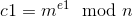
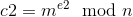
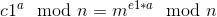
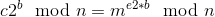
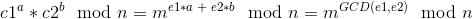
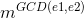

# Common-Modulus Attack
  
  
Prerequisites:
1. [RSA Encryption/Decryption](https://github.com/ashutosh1206/Crypton/blob/master/RSA-encryption/README.md)
  

Common Modulus attack works in the scenario when a message is encrypted in two different ways, once using a modulus and a public key exponent and another time using the same modulus but different public exponent. Mathematically, ciphertext in each case can be written as:  
  
  

## The Attack
Let us try and get the coefficients of [Bezout's Identity](https://en.wikipedia.org/wiki/B%C3%A9zout%27s_identity) using Extended Euclid Algorithm over `e1` and `e2`. I wrote a python implementation of the Extended Euclid Algorithm, which you can use:  
```python
def egcd(a, b):
  if (a == 0):
    return (b, 0, 1)
  else:
    g, y, x = egcd(b % a, a)
    return (g, x - (b // a) * y, y)
```
The function will return GCD of `e1` and `e2` along with the coefficients of Bezout's Identity `a` and `b` respectively. From Extended Euclid Algorithm we can write:  
```
(e1 * a) + (e2 * b) = GCD(e1, e2)  
```  
We can create a similar scenario as above using `c1` and `c2` that we have. Let us see how we can do it:  
First we take `c1` to the power `a` so that we have:  
  --> **(1)**   
Similarly we take `c2` to the power `b` to get:  
  --> **(2)**   
Multiplying equations (1) and (2) we have:  
  --> **(3)**   
Now that we have `GCD(e1, e2)` as the exponent of m, it is possible that the result of  may not wrap around the modulus N, ie.  may not be greater than the modulus N. In such cases, we can directly get message `m` from equation-3 as the GCD(e1, e2)th root of the result obtained in **equation-3**.  
  
You can check the implementation of the attack [here](exploit.py).  
  