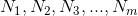
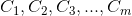

# Common-Prime Attack
  
  
Prerequisites:
1. [RSA Encryption/Decryption](https://github.com/ashutosh1206/Crypton/blob/master/RSA-encryption/README.md)
2. [Unpadded RSA Digital Signatures](https://github.com/ashutosh1206/Crypton/tree/master/Digital-Signatures/Unpadded-RSA-Digital-Signatures)
3. [Modular Multiplicative Inverse](https://en.wikipedia.org/wiki/Modular_multiplicative_inverse)

This attack works in a scenario where there is a fault in the generation of moduli for encrypting a message/signing a message. To be specific, using this attack we can find the prime factors of the public modulus if there are multiple moduli being generated using a **faulty** modulus generator. We will discuss what exactly does `faulty` modulus generator mean and further details of the attack in the next section.  
  
## The Attack
There can be two steps during the communication where the attack can work: a. **Encryption** and b. **Signature**. We will see the attack details in encryption and then simply move to implementating the same in Digital Signatures. Assume that a communication channel is already established between the message sender and the receiver, the following happens:  
1. A generator generates primes which the sender uses to construct the public modulus.
2. Sender then encrypts the message using public key constructed and sends the encrypted message over the communication channel.

The above two steps are done consecutively a number of times. That implies that we as an attack would now have a set of public keys and ciphertext, with the public moduli  and the corresponding ciphertexts   
  
Now suppose, the generator generates the same prime on two different instances, ie. two modulus have one common prime between them. This fault in the generation can help us factorise the two moduli that have a common prime, and once we factorise the moduli, we get the private key! Enough of theory, let us see how we can implement this:
1. From the set of retrieved moduli, find a pair of moduli N1, N2 which satisfy the following condition: GCD(N1, N2)!=1. If this is satisfied, it means that the corresponding moduli have a number in common ie. the common prime.
2. Then calculate the common prime as p = GCD(N1, N2), q1 = N1/p, q2 = N2/p
3. Calculate the corresponding private keys as d1 = modinverse(e, (p-1)\*(q-1)) and d2 = modinverse(e, (p-1)\*(q-1)), where modinverse(a, b) --> Modular multiplicative inverse of a over b.
  

You can check out the challenges based on this attack [here](Challenges/)