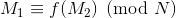
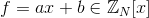
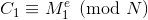
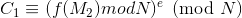
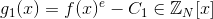
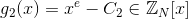

# Franklin Reiter's Attack on related messages

Prerequisites:
1. [RSA Encryption/Decryption](https://github.com/ashutosh1206/Crypton/blob/master/RSA-encryption/README.md) 
2. [Coppersmith's Theorem](https://github.com/ashutosh1206/Crypton/blob/master/RSA-encryption/Attack-Coppersmith/README.md)

This attack works in a scenario where two messages differ only by a fixed known difference and are encrypted using public key e and same modulus N. The attacker can then recover the two messages in the above scenario using Franklin Reiter's Attack.

## Theorem
Suppose there are two messages M1 and M2 where M1 != M2, both less than N and related to each other as  for some linear polynomial  where b!=0. These two messages are to be sent by encrypting using the public key (N, e), thus giving ciphertexts C1 and C2 respectively. Then, given (N, e, C1, C2, f), the attacker can recover messages M1 and M2.
  
  
## Proof
We can write C1 and C2 as:  
  
We can also write,  
  
  
We can then write the polynomials g1(x) and g2(x) as:  
  
  
So clearly M2 is a root of both the polynomials above and hence they have a common factor **x-M2** (Since, g1(M2) = 0 and g2(M2) = 0)
Therefore, we can simply calculate GCD of g1 and  g2 and if the resultant polynomial is linear, then we get out M2 and hence M1!  
  
    Exploit in a nutshell:
    1. Calculate g1 and g2 as given above
    2. Calculate GCD(g1, g2) and check if the resultant polynomial is linear or not
    3. If the resultant polynomial is linear, then return GCD
  
Check the **implementation** of the above attack [here](exploit.sage)
  
## References
1. [Wikipedia- Franklin Reiter's related message attack](https://en.wikipedia.org/wiki/Coppersmith%27s_attack#Franklin-Reiter_related-message_attack)

