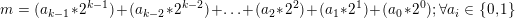
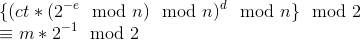
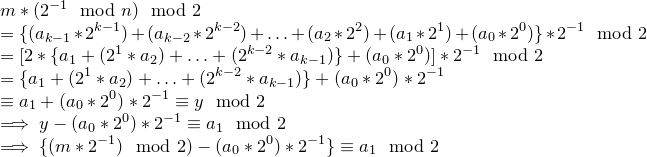
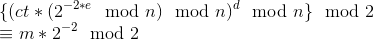
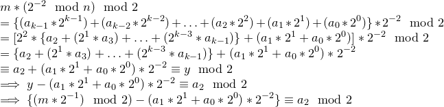
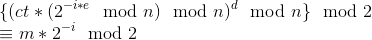
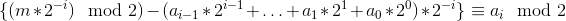

# LSBit Oracle Attack- a variant

Prerequisites:
1. [RSA Encryption/Decryption](../../RSA-encryption/README.md)
2. [LSBit Oracle Attack](../Attack-LSBit-Oracle/)


This variant of LSB Oracle Attacks is different as compared to the binary search LSB algorithm, for recovering plaintext, in terms of time complexity and ability to recover data on session renewal.

This attacks works due to leaking of the Least Significant Bit by an unpadded RSA encryption/decryption oracle that enables the adversary to decrypt the ciphertext in `len(plaintext)` requests to the oracle, where `len(plaintext)` is the length of plaintext to be decrypted *in bits*. In this article we will try to understand the logic and details behind the variant of LSB oracle attack on unpadded RSA.

## Background

Consider the following scenario:  
We have access to a service that allows us to encrypt/decrypt text using unpadded RSA. The service encrypts/decrypts using it's public key and private key respectively. But after decryption, the server only returns the last bit of the plaintext obtained. How can such a service be vulnerable?

An illustration of how the encryption/decryption described above could take place in the server:

```python
requests_limit_per_session = 1050

def _encrypt(message, e, n):
    m = bytes_to_long(message)
    return long_to_bytes(pow(m, e, n))

def _decrypt(ciphertext, d, n):
    ct = bytes_to_long(ciphertext)
    return long_to_bytes(pow(ct, d, n) % 2)

def genkey(size):
    p = getPrime(size/2)
    q = getPrime(size/2)
    e = 65537
    phin = (p-1)*(q-1)
    d = inverse(e, phin)
    n = p*q
    return (p, q, e, d, phin, n)

if __name__ == "__main__":
    p, q, e, d, phin, n = genkey(1024)
    flag = open("flag").read().strip()
    print "Welcome to RSA encryption oracle!"
    print "Here take your flag (in hex): ", _encrypt(flag, e, n).encode("hex")
    print "Here take modulus: ", n
    for i in range(requests_limit_per_session):
        print "RSA service"
        print "[1] Encrypt"
        print "[2] Decrypt"
        option = int(raw_input("Enter your choice: "))
        if option == 1:
            try:
                message = raw_input("Enter the message you want to encrypt (in hex): ").decode("hex")
            except:
                print "Enter proper hex chars"
                exit(0)
            ct = _encrypt(message, e, n)
            print "Here take your ciphertext (in hex): ", ct.encode("hex")
            print "\n\n"
        elif option == 2:
            try:
                ciphertext = raw_input("Enter the ciphertext you want to decrypt (in hex): ").decode("hex")
            except:
                print "Enter proper hex chars"
                exit(0)
            msg = _decrypt(ciphertext, d, n)
            print "Here take your plaintext (in hex): ", msg.encode("hex")
            print "\n\n"
        else:
            print "Enter a valid option!"
    print "Exiting..."
```

We have seen in [LSBit Oracle Attack](../Attack-LSBit-Oracle/) that such a service can be exploited and the plaintext can be recovered in , provided that the modulus remains the same in all the iterations, otherwise the attacker will have to start all over again (As far as the author knows).

In the next few sections we will discuss another method to recover the plaintext bit-by-bit irrespective of whether the modulus changes while iterating to recover plaintext.

## Vulnerability and Exploit

We know that the service returns the last bit of decrypted ciphertext ie. , where `ct` is the ciphertext and `m` is the plaintext.

How can we exploit this?  
> One idea is to somehow do some computation on the ciphertext to shift plaintext right by one bit in each iteration, this way we can obtain one bit of plaintext, starting from the from rightmost bit, in each iteration.

Next step is to implement this idea:  
We know that any `k`-bit plaintext `m` can be written as: 
1. Get the ciphertext you want to decrypt, let us assume that it to be `ct` and it's corresponding plaintext to be `m`
2. Send the same ciphertext to the oracle for decryption and the oracle will return the last bit of plaintext i.e. a<sub>0</sub>
3. We will now craft our chosen-ciphertext attack to recover all plaintext bits

### Chosen-Ciphertext Attack
Calculate  
  

>Note that the inverse of 2 is calculated over `mod n` and not over `mod 2`

From the above equation we can write:  
  

Now that we have the value of 2nd last bit of plaintext i.e. a<sub>1</sub>, we can adopt a similar approach to recover a<sub>2</sub>

Calculate  


From the above equation, we can write:


We can generalise this to compute and recover `i`th bit of plaintext from the end

Calculate


From the above equation, we can recover a<sub>i</sub> as:


**What if modulus changes during plaintext recovery (Due to service reconnection etc.)?** The attacker can still recover the remaining plaintext bits. He/She won't have to start over again in case of a service restart, since some bits of plaintext would have already been covered and the next iteration to recover a<sub>i</sub> can be done directly (See the above equation).
