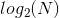
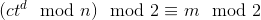
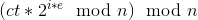
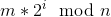
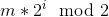
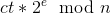
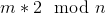

# Least Significant Bit Oracle Attack

Prerequisites:
1. [RSA Encryption/Decryption](../../RSA-encryption/README.md)

This attacks works due to leaking of the Least Significant Bit by an unpadded RSA encryption/decryption oracle that enables the adversary to decrypt the ciphertext in  requests to the oracle. In this article we will try to understand the logic and details behind LSB oracle attack on unpadded RSA.

## Background

Consider the following scenario:  
We have access to a service that allows us to encrypt/decrypt text using unpadded RSA. The service encrypts/decrypts using it's public key and private key respectively. After decryption, the server only returns the last bit of the plaintext obtained. How can such a service be vulnerable?

An illustration of how the encryption/decryption described above could take place in the server:

```python
def _encrypt(message, e, n):
    m = bytes_to_long(message)
    return long_to_bytes(pow(m, e, n))

def _decrypt(ciphertext, d, n):
    ct = bytes_to_long(ciphertext)
    return long_to_bytes(pow(ct, d, n) % 2)

def genkey(size):
    p = getPrime(size/2)
    q = getPrime(size/2)
    e = 65537
    phin = (p-1)*(q-1)
    d = inverse(e, phin)
    n = p*q
    return (p, q, e, d, phin, n)

if __name__ == "__main__":
    p, q, e, d, phin, n = genkey(1024)
    flag = open("flag").read().strip()
    print "Welcome to RSA encryption oracle!"
    print "Here take your flag (in hex): ", _encrypt(flag, e, n).encode("hex")
    print "Here take modulus: ", n
    for i in range(1050):
        print "RSA service"
        print "[1] Encrypt"
        print "[2] Decrypt"
        option = int(raw_input("Enter your choice: "))
        if option == 1:
            try:
                print "Coming here"
                message = raw_input("Enter the message you want to encrypt (in hex): ").decode("hex")
            except:
                print "Enter proper hex chars"
                exit(0)
            ct = _encrypt(message, e, n)
            print "Here take your ciphertext (in hex): ", ct.encode("hex")
            print "\n\n"
        elif option == 2:
            try:
                ciphertext = raw_input("Enter the ciphertext you want to decrypt (in hex): ").decode("hex")
            except:
                print "Enter proper hex chars"
                exit(0)
            msg = _decrypt(ciphertext, d, n)
            print "Here take your plaintext (in hex): ", msg.encode("hex")
            print "\n\n"
        else:
            print "Enter a valid option!"
    print "Exiting..."
```

# Vulnerability and Exploit
From the scenario discussed in the last section, we know that the service returns the last bit of the decrypted ciphertext, ie.   


Some observations before we can exploit the vulnerability:
1. Modulus n = p*q where `p` and `q` are primes. Since primes cannot be even and multiplication of two odd numbers is another odd number, `n` is always odd.
2. If we multiply any plaintext by multiples of `2`, the result will always be even, regardless of whether the plaintext is even or odd.
3. Any *even number* % *odd number* is always odd.

Suppose `ct` is the ciphertext of message `m` we want to decrypt, `e` is the public key exponent and `n` is the modulus.  

We can get the plaintext by choosing a ciphertext such that after sending `q` number of requests, we are able to get the corresponding plaintext of the ciphertext we want to decrypt. This is known as chosen-ciphertext-attack.  

If we send  to the server as the ciphertext (where i=0,1,2,...,(n/e)), it will decrypt to  and the server will return .

Suppose we send  to the server as the ciphertext which will be decrypted to . Two cases can arise:  
1. If `2*m > n`, then the server will return `1` as the output (since 2\*m is even and `1` can be returned only when 2\*m > n, see observation-3) and then we can write `m > n/2`
2. If `2*m < n` then the server will return `0` as the output. We can then write `m < n/2`

Consider two messages 2\*m and 4\*m [\[1\]](https://crypto.stackexchange.com/questions/11053/rsa-least-significant-bit-oracle-attack) and let us see under what values of the output, do we get the range of `m`:  
1. **even**, **even**: `m < n/4`
2. **even**, **odd**: `n/4 < m < n/2`
3. **odd**, **even**: `n/2 < m < 3n/4`
4. **odd**, **odd**: `(3/4)n < m < n`  

You must be wondering how condition 3 and 4 above hold true. You will understand better when you see the script implementing this:  
```python
e = 65537
upper_limit = N
lower_limit = 0

flag = ""
i = 1
# for 1024 bit N
while i <= 1024:
    chosen_ct = long_to_bytes((bytes_to_long(flag_enc)*pow(2**i, e, N)) % N)
    output = _decrypt(chosen_ct)
    if ord(output[-1]) == 0:
        upper_limit = (upper_limit + lower_limit)/2
    elif ord(output[-1]) == 1:
        lower_limit = (lower_limit + upper_limit)/2
    else:
        throw Exception
    i += 1

# Decrypted ciphertext
print long_to_bytes(upper_limit)
```

Now try understanding the conditions 3 and 4 using the above script:
1. In case 3, where the output is (**odd**, **even**): After sending 2\*m for which the result is odd, `lower_limit` becomes n/2, if we consider execution using the above script. When we send 4\*m for which the result is even, `upper_limit` is evaluated as `(lower_limit + upper_limit)/2` = (n/2 + n)/2 = 3n/4. Hence, `lower_limit < m < upper_limit` = `n/2 < m < 3n/4`
2. In case 4, where the output is (**odd**, **odd**): After sending 2\*m for which the results is odd, `lower_limit` becomes n/2, if we consider execution using the above script. When we send 4\*m for which the result is odd, `lower_limit` again evaluates to `(lower_limit + upper_limit)/2` = (n/2 + n)/2 = 3n/4. In this case, `upper_limit` value did not change and remained equal to `n`. Hence `lower_limit < m < upper_limit` = `3n/4 < m < n`.


It is somewhat similar to binary search algorithm, because our attack is doing the same (lowering the range of `m` until we get `m`), hence the complexity of this attack is **log<sub>2</sub>n**.

Note that the above script messes up the last byte of the plaintext. I am trying to find out why, and will update the README as soon as I get it.

I have written a script illustrating a server vulnerable to this attack, which you can find here: [encrypt.py](encrypt.py). You can also find the script I wrote to attack the above vulnerable service, which you can find here: [exploit.py](exploit.py)  

You can check out a general implementation of this attack (that can be used for solving CTF challenges) here: [lsbitoracle.py](lsbitoracle.py).  

## References
[1] [Stack Overflow- RSA Least Significant Bit Oracle Attack](https://crypto.stackexchange.com/questions/11053/rsa-least-significant-bit-oracle-attack/)
