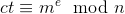
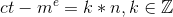
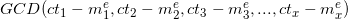
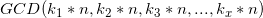
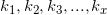
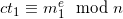
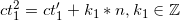
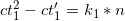
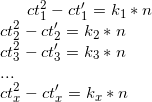
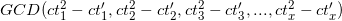

# Retrieve RSA Modulus

In this section we will discuss how to extract the value of modulus-`N` from an oracle that allows us to encrypt data using unpadded RSA but does not give the value of `N`, given an input plaintext `pt`. We will discuss two methods by which we can extract the modulus, under following conditions:
1. When value of `e` is known
2. When value of `e` is unknown

## Case Scenario
Consider a situation where we (as an attacker) have access to a service that allows us to encrypt text using unpadded RSA. The service encrypts using it's public key but does not give out the value of the modulus.  

This is a common scenario in a CTF challenge where the first part in exploiting a crypto challenge based on RSA is to extract the value of the modulus. But there are restrictions set by a challenge author to make things difficult. Sometimes, the service does not reveal the value of public key exponent `e`.

So, depending on whether the service reveals `e` or not, we will exploit the service to extract `N`.

## Value of `e` known
In case the service allows access to public key exponent `e`, the exploit is fairly simple.

First let us discuss the background details. We know that in RSA encryption, for a message `m`, public key exponent `e` and modulus `n`, ciphertext `ct` is generated as follows: . Hence, we can also write: .

Now, if we have `x > 2` pairs of ciphertexts such that:  
  
If we compute the following:  , which is equal to
, it will most probably be equal to `n`.

Why "most probably"? Because it depends upon the kind of numbers  are and what their GCD is.
1. If GCD() == 1, then we will get **n** upon taking 
2. If GCD() != 1, then we will get **n\*GCD()** upon taking , ie. we will get a multiple of `n`

So, higher the number of ciphertexts we have, greater is the chance that we will get `n`. Mostly, we will be able to get `n` in about **4** ciphertext-plaintext pairs.

Note that in this situation, we need the value of `e`, message `m` and corresponding ciphertext `ct` to calculate  = `n`

## Value of `e` unknown
In case the service does not allow access to the value of public exponent `e`, we can adopt a different approach.

Again, let us discuss the background details for this scenario and then move on to the exploit. We know that for ciphertexts ct1 and ct2 generated from messages m1 and m12 respectively, we can write  
  
  

We can also write that ,  
.

Now, if we have `x > 2`,  
  
Now we compute  which will equal to  and will most probably be equal to `n`.

Higher the ciphertext pairs, greater is the chance of GCD being equal to the modulus `n`. Reasons for the GCD being a multiple of `n` is already discussed in the previous section.

### Implementation and Challenges

You can find an implementation of both the methods here: [extractmod.py](extractmod.py). Also, checkout some CTF challenges that involve extracting the value of modulus in the [challenges](Challenges/) directory.

> Note: Function for extracting the value of modulus without knowing the value of `e` can even be used in cases where value of `e` is given.

# References
1. [StackExchange- Deduce modulus](https://crypto.stackexchange.com/questions/43583/deduce-modulus-n-from-public-exponent-and-encrypted-data)
