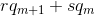
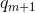
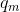

# A variant of Wiener's Attack on RSA

Prerequisites:
1. [RSA Encryption/Decryption](https://github.com/ashutosh1206/Crypton/blob/master/RSA-encryption/README.md)
2. [Wiener's Attack on RSA](https://github.com/ashutosh1206/Crypton/tree/master/RSA-encryption/Attack-Wiener)

As we know that Wiener's Attack works in case where d < N<sup>1/4</sup>. This attack works in the scenario when d is a few bits greater than N<sup>1/4</sup>.  
  
## The Attack
The attack says that in case `d` is a few bits greater than N<sup>1/4</sup> candidates for private key exponent are of the form , where  and  is `(m+1)`th and `(m)`th convergent of continued fraction of `e/n`. We can apply this to our exploit as follows:
```python
def wiener(e, n):
	m = 12345
	c = pow(m, e, n)
	q0 = 1

	list1 = continued_fraction(Integer(e)/Integer(n))
	conv = list1.convergents()
	for i in conv:
		k = i.numerator()
		q1 = i.denominator()

		for r in range(30):
			for s in range(30):
				d = r*q1 + s*q0
				m1 = pow(c, d, n)
				if m1 == m:
					return d
		q0 = q1
        return None
```
The exploit script [here](exploit.py). You can also read this paper [here](https://www.math.tugraz.at/~cecc08/abstracts/cecc08_abstract_20.pdf) that discusses variant of Wiener's Attack in detail.
  
  
## References
1. [A variant of Wiener's Attack on RSA- Andrej Dujella](https://www.math.tugraz.at/~cecc08/abstracts/cecc08_abstract_20.pdf)