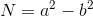

# Fermat's Factorisation

Prerequisites:
1. [RSA Encryption/Decryption](https://github.com/ashutosh1206/Crypton/blob/master/RSA-encryption/README.md)

Fermat's Factorisation is based on the representation of odd integer as difference of two squares:  
  
This difference is factorable as **(a+b)*(a-b)**  
We can use the above property to factorise modulus N in RSA when the difference between the primes is small:  
Difference ~ (N)1/4  
  
## Basic Fermat's Factorisation
To implement basic approach of Fermat's Factorisation, we can do the following:  
1. Calculate `a` as ceil of square root of N
2. Calculate `b2` = a**2 - N
3. Check if `b2` is a perfect square. If b2 is a perfect square then `return a - Square_root(b2)` and `a + Square_root(b2)` as the factors. If not, do the following:  
   - Increment `a` by 1, i.e. a += 1
   - Calculate `b2` again as a**2 - N
   - Repeat Step-3

Check out the implementation of basic Fermat's Factorisation [here](fermat.sage)  
  
  
## References
1. [Fermat's Factorisation](http://www.cse.unt.edu/~tarau/teaching/PP/NumberTheoretical/FACTORING/Fermat%27s%20factorization%20method.pdf)
