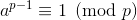
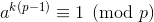

# Pollard's p-1 Factorisation

Prerequisites:
1. [Fermat's Little Theorem](https://en.wikipedia.org/wiki/Fermat%27s_little_theorem)
2. [RSA Encryption/Decryption](https://github.com/ashutosh1206/Crypton/blob/master/RSA-encryption/README.md)

Let the modulus be `N` and its factors be `p` and `q`. The factorisation technique described here **works only when p-1 and q-1 have very small prime factors**.  
  
## The idea
We can write from Fermat's Theorem:
, where `p` is a prime and `a` is any positive integer.  
Thus, we can write for any positive integer `k` that,  
  
  
where `r` is a positive integer  
  
If we now take GCD of `p*r` and `N = p*q`, we will have:  
**GCD(p*r, N) = p**  
And thus, we have got one of the factors of `N` using this method. The method is not so easy to implement as we will see in the next section. The idea is to make the exponent a large multiple of `p − 1` by making it a number with very many prime factors; generally, we take the product of all prime powers less than some limit `B`.  
  
  
## The exploit
To understand this attack, you can watch this video by [David Wong](https://github.com/mimoo) on [Pollard's p-1 Factorisation](https://www.youtube.com/watch?v=795heP3aUOE)  
  
Implementation of the above technique:

```python
def pollard(n, B):
    a = 2
    for p in primes(B):
        pp = 1
        while pp*p <= B:
            pp *= p
        a = pow(a, pp, n)   # provided a>=b, GCD(a, b) = GCD(a % b, b)
        g = gcd(a-1, n)
        if 1 < g < n:
            return g
    return None
```
You can checkout the exploit [here](exploit.py)  
  
## References
1. [David Wong- Pollard's p-1 Factorisation](https://www.youtube.com/watch?v=795heP3aUOE)
2. [Wikipedia- Pollard's p-1 Factorisation](https://en.wikipedia.org/wiki/Pollard%27s_p_%E2%88%92_1_algorithm)


