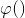
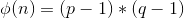
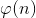
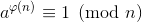
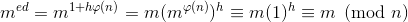

# RSA - Public Key Cryptosystem

RSA is one of the first public key cryptosystems used commercially for secure data transmission. The key is asymmetric, meaning that the key used for encryption and decryption is not same. As we go through internals of encryption/decryption, we will understand why this cryptosystem is called a <strong>public key</strong> cryptosystem. Unlike symmetric key cryptosystems, there exists two pairs of keys in Public Key Cryptosystems: A private key pair and a public key pair. Each individual has his/her own set of unique private-public keys. The private key is completely secret for each individual and only he/she knows it's value, whereas public key of an individual who wants to receive a message is sent to anyone who wants to send a message, via a reliable channel. We will see what exactly reliable channel means, as we move through the explanation.

There are several steps in the process of encryption/decryption:
1. Key Generation
2. Key Distribution
3. Encryption/Decryption

We will also discuss attacks on RSA due to vulnerabilties in implementation and in the end discuss the need for `padding` in RSA.

Let us first define variables that will be repeatedly used:
1. <strong>p</strong>,<strong>q</strong> : Two very large primes 
2. <strong>n</strong> : Modulus, n = p*q
3. <strong>e</strong> : Public key exponent
4. <strong>d</strong> : Private key exponent
5. <strong>M</strong> : Unpadded message
3. <strong>m</strong> : Padded message
4. <strong>c</strong> : Ciphertext
5.  : [Euler's totient Function](https://en.wikipedia.org/wiki/Euler%27s_totient_function)

## Key Generation
1. Choose two distinct primes <strong>p</strong> and <strong>q</strong>. Both the primes must be chosen randomly and must have same bit length (for example: it is safe to have 512 bit `p` along with 512 bit `q`). There should be a significant difference between primes otherwise it will become vulnerable to [Fermat's Factorisation](Factorisation-Fermat/).
2. Compute n = p*q
3. Calculate the value of  which is  in this case. 
4. Choose an integer `e` such that 1 < e <  and GCD(e, ) = 1. `e` is often selected small and to be in the form of 22i+1 (where i is a positive integer), numbers of this format are known as [Fermat Numbers](https://en.wikipedia.org/wiki/Fermat_number), because it makes exponentiation more efficient. But, selecting very small values of `e` can make RSA vulnerable to some attacks under certain conditions.
5. Compute `d` as d = e-1 mod 
6. The pair `(e, n)` is known as public key and `(d, n)` is known as private key.

## Key Distribution
Suppose Bob wants to send a message to Alice. If they decide to use RSA, Bob must know Alice's public key to encrypt the message and Alice must use her private key to decrypt the message. To enable Bob to send his encrypted messages, Alice transmits her public key (n, e) to Bob via a reliable, but not necessarily secret, route. Alice's private key (d) is never distributed. _Reliable channel_ --> keys are sent without any alterations in their values. 

## Encryption
After Bob receives Alice's public key, he does the following operations:
1. Pads the message M using an agreed-upon reversible padding scheme to get m
2. Computes ciphertext c = me mod n
3. Transmits the ciphertext c using a reliable channel

## Decryption
After receiving the ciphertext c from Bob, Alice computes the following to get back the message:
1. Computes m = cd mod n (Since c = me mod n, cd mod n = me*d mod n = m. See proof: [Proof of decryption using Euler's Theorem](https://github.com/ashutosh1206/Crypton/tree/master/RSA-encryption#proof-of-decryption-using-eulers-theorem) \)
2. Reverses the padding scheme to get back M

### Proof of decryption using Euler's Theorem
Read about Euler's Theorem [here](https://en.wikipedia.org/wiki/Euler%27s_theorem). Thus we have: 
c = Me mod n  
cd mod n = Med mod n  
Since we have from Euler's theorem that: , we can now write  

## Padding and Padding Schemes
RSA without padding is often regarded as `Textbook RSA`. There are a number of attacks that are possible when the message to be sent is not padded before RSA encryption:
1. **Direct Square Root**: Happens when e is very small (for ex: e = 3) and n is large. It often happens that message to be sent after exponentiation with e, is not large enough to be greater than n. In such cases, we can simply calculate m as the eth root of ciphertext. 
2. [Hastad's Broadcast Attack](Attack-Hastad-Broadcast/)
3. **Chosen Ciphertext Attacks**: Because RSA encryption is a deterministic encryption algorithm (i.e., has no random component) an attacker can successfully launch a chosen plaintext attack against the cryptosystem, by encrypting likely plaintexts under the public key and test if they are equal to the ciphertext. A cryptosystem is called semantically secure if an attacker cannot distinguish two encryptions from each other, even if the attacker knows (or has chosen) the corresponding plaintexts. As described above, RSA without padding is not semantically secure.

To avoid such attacks, RSA implementations add randomised padding to a message before encryption. The padding bytes follow a specific standard, for example: [PKCS](https://en.wikipedia.org/wiki/PKCS), [OAEP](https://en.wikipedia.org/wiki/Optimal_asymmetric_encryption_padding) etc. Padding ensures that the plaintext message does not become vulnerable to the above attacks. However, in 1998 Bleichenbacher showed that PKCS#1 is vulnerable to a form of `chosen ciphertext attack` known as Bleichenbacher's Padding Oracle Attack on RSA. Newer versions of PKCS are secure and resistant to such attacks. 

## References 
1. [Wikipedia: RSA-cryptosystem](https://en.wikipedia.org/wiki/RSA_(cryptosystem))
